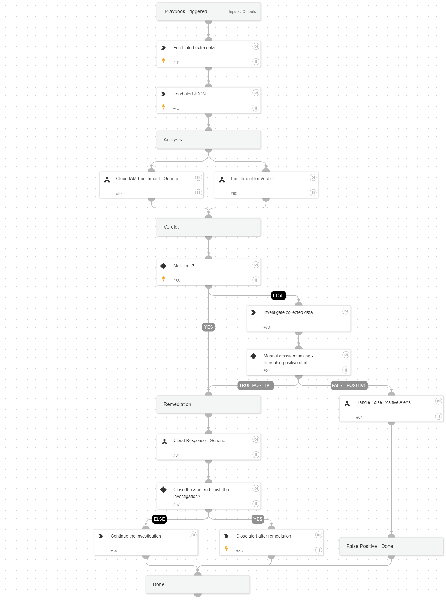

Investigate and respond to Cortex XSIAM alerts where a Cloud IAM user access key is used suspiciously to access the cloud environment.
The following alerts are supported for AWS, Azure, and GCP environments.
Penetration testing tool attempt
Penetration testing tool activity
Suspicious API call from a Tor exit node

## Dependencies

This playbook uses the following sub-playbooks, integrations, and scripts.

### Sub-playbooks

* Cloud IAM Enrichment - Generic
* Handle False Positive Alerts
* Enrichment for Verdict
* Cloud Response - Generic
* Ticket Management - Generic

### Integrations

* CortexCoreIR

### Scripts

* LoadJSON

### Commands

* setParentIncidentFields
* closeInvestigation
* core-get-cloud-original-alerts

## Playbook Inputs

---

| **Name** | **Description** | **Default Value** | **Required** |
| --- | --- | --- | --- |
| autoAccessKeyRemediation | Whether to execute the user remediation flow automatically. | False | Optional |
| autoBlockIndicators | Whether to block the indicators automatically. | True | Optional |
| autoUserRemediation | Whether to execute the user remediation flow automatically. | False | Optional |
| AWS-accessKeyRemediationType | Choose the remediation type for the user's access key.  AWS available types: Disable - for disabling the user's access key. Delete - for deleting the user's access key. | Disable | Optional |
| AWS-userRemediationType | Choose the remediation type for the user involved.  AWS available types: Delete - for deleting the user. Revoke - for revoking the user's credentials. | Revoke | Optional |
| Azure-userRemediationType | Choose the remediation type for the user involved.  Azure available types: Disable - for disabling the user. Delete - for deleting the user. | Disable | Optional |
| GCP-accessKeyRemediationType | Choose the remediation type for the user's access key.  GCP available types: Disable - For disabling the user's access key. Delete - For deleting the user's access key. | Disable | Optional |
| GCP-userRemediationType | Choose the remediation type for the user involved.  GCP available types: Delete - For deleting the user. Disable - For disabling the user. | Disable | Optional |
| ShouldCloseAutomatically | Whether to close alerts automatically as a false positive. \(True/False\). | False | Optional |
| ShouldOpenTicket | Whether to open a ticket automatically in a ticketing system. \(True/False\). | False | Optional |
| serviceNowShortDescription | A short description of the ticket. | XSIAM Incident ID - ${parentIncidentFields.incident_id} | Optional |
| serviceNowImpact | The impact for the new ticket. Leave empty for ServiceNow default impact. |  | Optional |
| serviceNowUrgency | The urgency of the new ticket. Leave empty for ServiceNow default urgency. |  | Optional |
| serviceNowSeverity | The severity of the new ticket. Leave empty for ServiceNow default severity. |  | Optional |
| serviceNowTicketType | The ServiceNow ticket type. Options are "incident", "problem", "change_request", "sc_request", "sc_task", or "sc_req_item". Default is "incident". |  | Optional |
| serviceNowCategory | The category of the ServiceNow ticket. |  | Optional |
| serviceNowAssignmentGroup | The group to which to assign the new ticket. |  | Optional |
| ZendeskPriority | The urgency with which the ticket should be addressed. Allowed values are "urgent", "high", "normal", or "low". |  | Optional |
| ZendeskRequester | The user who requested this ticket. |  | Optional |
| ZendeskStatus | The state of the ticket. Allowed values are "new", "open", "pending", "hold", "solved", or "closed". |  | Optional |
| ZendeskSubject | The value of the subject field for this ticket. | XSIAM Incident ID - ${parentIncidentFields.incident_id} | Optional |
| ZendeskTags | The array of tags applied to this ticket. |  | Optional |
| ZendeskType | The type of this ticket. Allowed values are "problem", "incident", "question", or "task". |  | Optional |
| ZendeskAssigne | The agent currently assigned to the ticket. |  | Optional |
| ZendeskCollaborators | The users currently CC'ed on the ticket. |  | Optional |
| description | The ticket description. | ${parentIncidentFields.description}. ${parentIncidentFields.xdr_url} | Optional |
| addCommentPerEndpoint | Whether to append a new comment to the ticket for each endpoint in the incident. Possible values: True/False. | True | Optional |
| CommentToAdd | Comment for the ticket. | ${alert.name}. Alert ID: ${alert.id} | Optional |

## Playbook Outputs

---
There are no outputs for this playbook.

## Playbook Image

---

