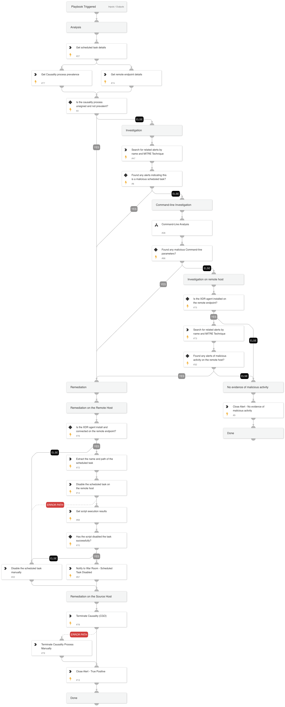

This playbook handles "Uncommon remote scheduled task creation" alert, which is generated on the source host that created the remote scheduled task.

Playbook Stages:

Analysis:

- The playbook verifies whether the causality process is signed and prevalent. If the process is not signed and not prevalent, it proceeds with remediation actions; otherwise, it continues investigating the alert.

Investigation:

During the alert investigation, the playbook will perform the following:

- Searches for related Cortex XSIAM alerts on the endpoint that use the following MITRE techniques to identify malicious activity: T1202 - Indirect Command Execution, T1021 - Remote Services.
- Searches for related Cortex XSIAM agent alerts on the remote endpoint, to determine if the creation of the scheduled task is part of an attack pattern.
- Searches for suspicious command-line parameters indicating a malicious scheduled task.

Remediation:

- Automatically disable the malicious scheduled task on the remote host.
- Automatically terminate the causality process.
- Automatically close the alert.

## Dependencies

This playbook uses the following sub-playbooks, integrations, and scripts.

### Sub-playbooks

* Command-Line Analysis

### Integrations

* CortexCoreIR

### Scripts

* Print
* SearchIncidentsV2
* Set

### Commands

* core-get-process-analytics-prevalence
* core-get-endpoints
* core-get-cloud-original-alerts
* core-run-script-execute-commands
* closeInvestigation
* core-get-script-execution-results
* core-terminate-causality

## Playbook Inputs

---
There are no inputs for this playbook.

## Playbook Outputs

---
There are no outputs for this playbook.

## Playbook Image

---

