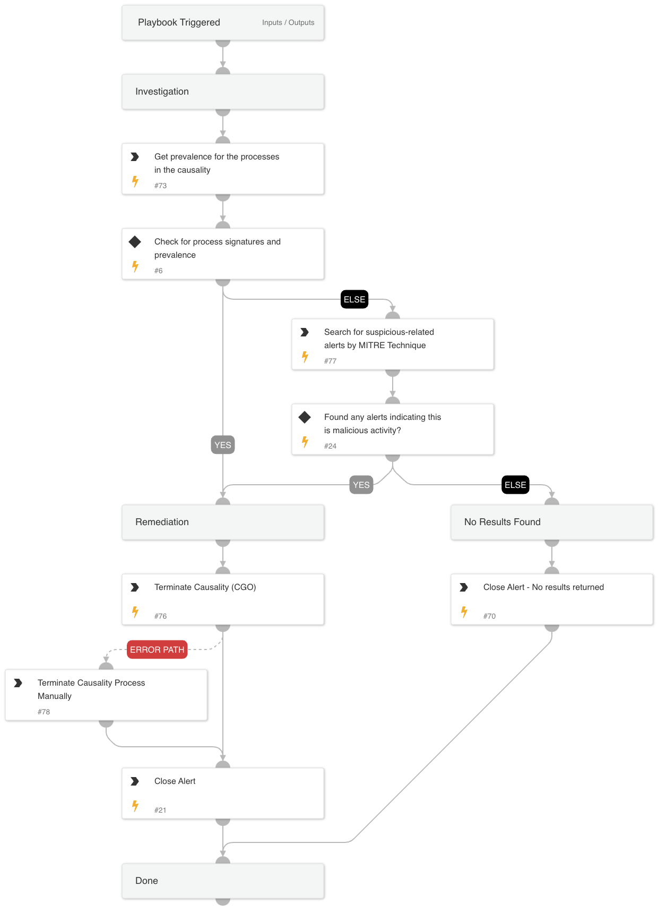

This playbook is designed to handle the following alerts:  
- Windows Event Log was cleared using wevtutil.exe
- Security Event Log was cleared using wevtutil.exe
- A Sensitive Windows Event Log was cleared using wevtutil.exe
- Windows event logs were cleared with PowerShell
- Suspicious clear or delete security provider event logs with PowerShell
- Suspicious clear or delete default providers event logs with PowerShell
- Windows event logs cleared using wmic.exe

The playbook executes the following stages:

Investigation:
Check the following parameters to determine if remediation actions are needed:
- Cortex XSIAM alerts related to the hostname by MITRE tactics indicating malicious activity.
- Whether the CGO or the OSParent process is unsigned.
- The prevalence of the OSParent process.

Remediation:
- Handles malicious alerts by terminating the relevant processes.
- Handles non-malicious alerts identified during the investigation.

## Dependencies

This playbook uses the following sub-playbooks, integrations, and scripts.

### Sub-playbooks

This playbook does not use any sub-playbooks.

### Integrations

CortexCoreIR

### Scripts

SearchIncidentsV2

### Commands

* core-get-process-analytics-prevalence
* core-terminate-causality
* closeInvestigation

## Playbook Inputs

---
There are no inputs for this playbook.

## Playbook Outputs

---
There are no outputs for this playbook.

## Playbook Image

---

