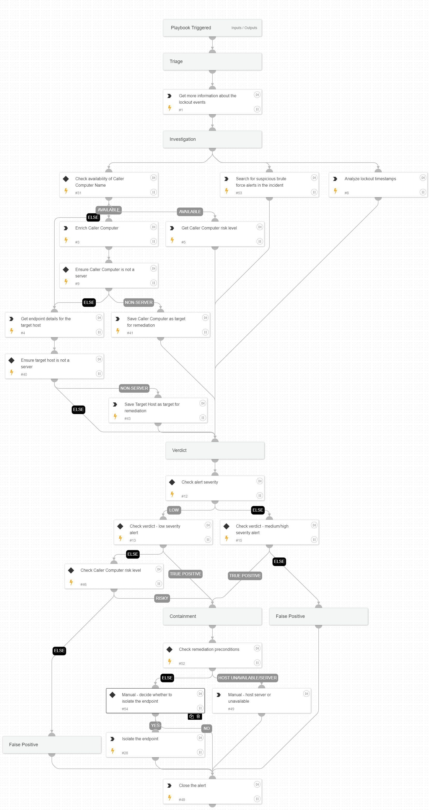

This playbook is designed to handle the following alerts:

- Excessive user account lockouts
- Excessive account lockouts on suspicious users
- Excessive user account lockouts from a suspicious source

The playbook investigates and responds to excessive user account lockout alerts. It gathers information about the alert, enriches relevant host data, and analyzes event patterns. This analysis helps distinguish between benign lockouts and lockouts caused by brute-force or password spray attacks.

Playbook Stages:

Triage:

- Enriches the alert with details about the lockout events.

Investigation:

- Analyzes the lockout event timestamps to detect patterns.
- Checks for related medium severity brute-force alerts in the incident.
- Retrieves the Risk Score for the Caller Computer that caused the lockouts.

Containment:

- With analyst approval, the playbook can isolate the endpoint (either the Caller Computer or the target host) if it's determined to be a true positive and not a server.

Requirements:

- For response actions, the following integration is required: Core - IR.

## Dependencies

This playbook uses the following sub-playbooks, integrations, and scripts.

### Sub-playbooks

This playbook does not use any sub-playbooks.

### Integrations

* CortexCoreIR

### Scripts

* AnalyzeTimestampIntervals
* SearchAlertsV2
* SetAndHandleEmpty

### Commands

* closeInvestigation
* core-get-cloud-original-alerts
* core-get-endpoints
* core-isolate-endpoint
* core-list-risky-hosts

## Playbook Inputs

---
There are no inputs for this playbook.

## Playbook Outputs

---
There are no outputs for this playbook.

## Playbook Image

---

