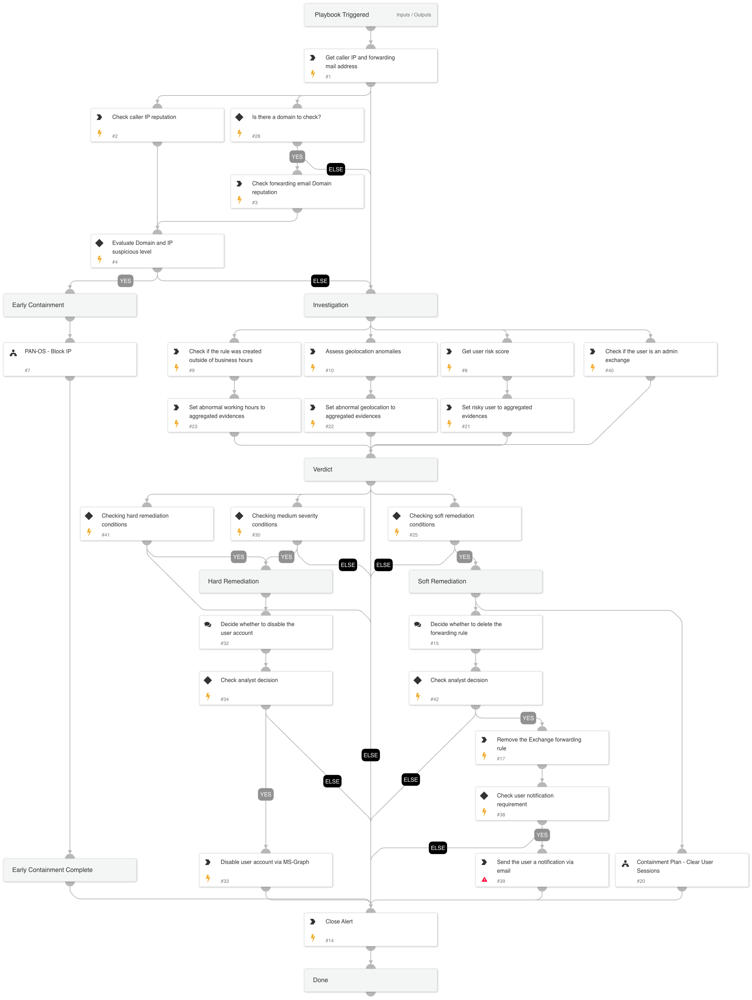

This playbook addresses the following alerts:

- External Exchange inbox forwarding rule configured.
- Suspicious Exchange inbox forwarding rule configured.
- Suspicious Exchange email-hiding inbox rule.

Playbook Stages:
 
Triage: 

- The playbook retrieves the caller's IP, the forwarding email address, and the domain.

Early Containment:

- The playbook checks if the IP or domain of the forwarding email address is malicious. If so, it suggests blocking the IP using PAN-OS while continuing the investigation in parallel.

Investigation:

- The playbook checks for suspicious behaviors, including whether an Exchange admin created the rule outside of working hours, from unusual geolocation, or if the user who created the rule has a high-risk score. It then aggregates all evidence collected during the investigation.

Containment:

- If at least two suspicious pieces of evidence are found, the playbook executes soft response actions, including signing the user out and deleting the forwarding email address from the user account mailbox. The user will be notified of these actions via email.
- If more than two pieces of suspicious evidence are found, the playbook will initiate hard response actions. These include disabling the user and removing the forwarding email address from their mailbox. The user will be notified of these actions via email.

Requirements: 

For any response action, you need the following integrations:
- EWS Extension Online Powershell v3 integration.
- Azure Active Directory Users.

## Dependencies

This playbook uses the following sub-playbooks, integrations, and scripts.

### Sub-playbooks

* Containment Plan - Clear User Sessions
* PAN-OS - Block IP

### Integrations

* CoreIOCs
* CortexCoreIR
* CortexCoreXQLQueryEngine
* EWSO365

### Scripts

* AnyMatch
* BetweenHours
* SetAndHandleEmpty

### Commands

* closeInvestigation
* core-get-cloud-original-alerts
* core-list-risky-users
* domain
* ews-remove-rule
* ip
* msgraph-user-account-disable
* send-mail

## Playbook Inputs

---

| **Name** | **Description** | **Default Value** | **Required** |
| --- | --- | --- | --- |
| SendNotification | If set to "true," the playbook will send an email notification to the user informing them that the forwarding address was deleted. If "false," no notification will be sent. | true | Optional |

## Playbook Outputs

---
There are no outputs for this playbook.

## Playbook Image

---

