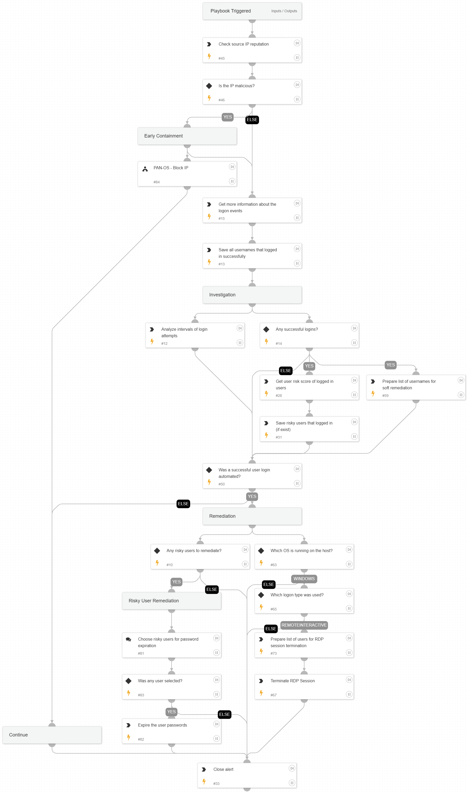

This playbook investigates and responds to external login password sprays. It starts by enriching the external IP, allowing early containment. It then fetches event information to learn more about the attack - how it was executed and whether it succeeded or not.
For remediation, the playbook checks for RemoteInteractive (RDP) sessions to close, and allows the analyst to expire the password of any users that successfully logged in as part of the attack.

## Dependencies

This playbook uses the following sub-playbooks, integrations, and scripts.

### Sub-playbooks

* PAN-OS - Block IP

### Integrations

* CoreIOCs
* CortexCoreXQLQueryEngine
* CortexCoreIR

### Scripts

* SetAndHandleEmpty
* AnalyzeTimestampIntervals

### Commands

* ad-expire-password
* core-list-risky-users
* core-get-cloud-original-alerts
* core-run-script-execute-commands
* closeInvestigation
* ip

## Playbook Inputs

---
There are no inputs for this playbook.

## Playbook Outputs

---
There are no outputs for this playbook.

## Playbook Image

---

