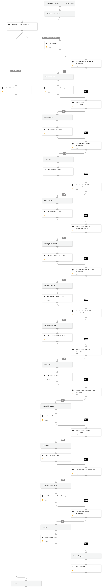

This playbook searches XDR alerts related to specific entities, on a given timeframe, based on MITRE tactics.
Note: The playbook's inputs enable manipulating the execution flow. Read the input descriptions for details.

## Dependencies

This playbook uses the following sub-playbooks, integrations, and scripts.

### Sub-playbooks

This playbook does not use any sub-playbooks.

### Integrations

This playbook does not use any integrations.

### Scripts

* SearchAlertsV2
* SetAndHandleEmpty

### Commands

This playbook does not use any commands.

## Playbook Inputs

---

| **Name** | **Description** | **Default Value** | **Required** |
| --- | --- | --- | --- |
| HuntReconnaissanceTechniques | Set to True to hunt for identified alerts with MITRE Reconnaissance techniques. | False | Optional |
| HuntInitialAccessTechniques | Set to True to hunt for identified alerts with MITRE Initial Access techniques. | False | Optional |
| HuntExecutionTechniques | Set to True to hunt for identified alerts with MITRE Execution techniques. | False | Optional |
| HuntPersistenceTechniques | Set to True to hunt for identified alerts with MITRE Persistence techniques. | False | Optional |
| HuntPrivilegeEscalationTechniques | Set to True to hunt for identified alerts with MITRE Privilege Escalation techniques. | False | Optional |
| HuntDefenseEvasionTechniques | Set to True to hunt for identified alerts with MITRE Defense Evasion techniques. | False | Optional |
| HuntDiscoveryTechniques | Set to True to hunt for identified alerts with MITRE Discovery techniques. | False | Optional |
| HuntLateralMovementTechniques | Set to True to hunt for identified alerts with MITRE Lateral Movement techniques. | False | Optional |
| HuntCollectionTechniques | Set to True to hunt for identified alerts with MITRE Collection techniques . | False | Optional |
| HuntCnCTechniques | Set to True to hunt for identified alerts with MITRE Command and Control techniques. | False | Optional |
| HuntImpactTechniques | Set to True to hunt for identified alerts with MITRE Impact techniques. | False | Optional |
| HuntCredentialAccessTechniques | Set to True to hunt for identified alerts with MITRE Credential Access techniques. | False | Optional |
| timeRange | A time range to execute the hunting in. The input should be in the following format: \* 1 day \* 2 minutes \* 4 hours \* 8 days | 6 hours | Required |
| RunAll | Whether to run all the sub-tasks for Mitre Tactics. | True | Optional |
| EntityType | Entity type to search. Entity type can be username, hostname, or any other element that exists in the alert. |  | Required |
| EntityID | Entity value. |  | Required |

## Playbook Outputs

---

| **Path** | **Description** | **Type** |
| --- | --- | --- |
| foundIncidents | Alerts found. | unknown |

## Playbook Image

---

