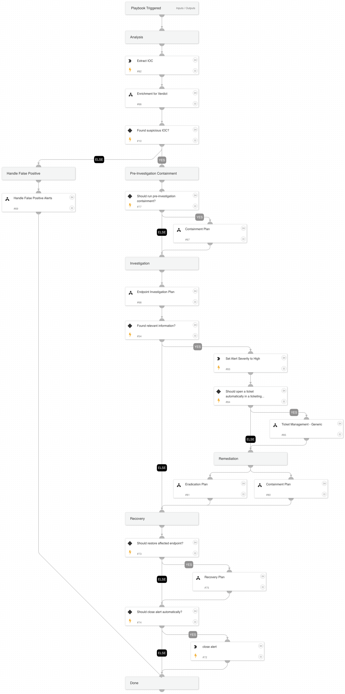

IOCs provide the ability to alert on known malicious objects on endpoints across the organization. 

**Analysis Actions:**
The playbook will use several enrichment sources to determine the IOC verdict. Additionally, will use the Analytics module to run a prevalence check for the IOC.

**Response Actions:**
The playbook's first response action is a containment plan that is based on the playbook input. In that phase, the playbook will execute endpoint isolation

**Investigative Actions:**
When the playbook executes, it checks for additional abnormal activity using the Endpoint Investigation Plan playbook that can indicate the endpoint might be compromised.

**Remediation Actions:**
In case results are found within the investigation phase, the playbook will execute remediation actions that include containment and eradication.

This phase will execute the following containment actions:

* File quarantine
* Endpoint isolation

And the following eradication actions:

* Manual process termination
* Manual file deletion

## Dependencies

This playbook uses the following sub-playbooks, integrations, and scripts.

### Sub-playbooks

* Endpoint Investigation Plan
* Recovery Plan
* Eradication Plan
* Enrichment for Verdict
* Handle False Positive Alerts
* Ticket Management - Generic
* Containment Plan

### Integrations

This playbook does not use any integrations.

### Scripts

This playbook does not use any scripts.

### Commands

* extractIndicators
* setParentIncidentFields
* closeInvestigation

## Playbook Inputs

---

| **Name** | **Description** | **Default Value** | **Required** |
| --- | --- | --- | --- |
| BlockIndicatorsAutomatically | Whether to block suspicious/malicious indicators automatically. Specify True/False. | False | Optional |
| ShouldCloseAutomatically | Whether to close the alert automatically if it's established verdict is False Positive. Specify True/False. | True | Optional |
| PreHostContainment | Whether to isolate the host before the investigation phase in case an IOC was found to be suspicious. Specify True/False. | False | Optional |
| ShouldHandleFPautomatically | Whether to automatically handle false positive alerts. Specify true/false. |  | Optional |
| AutoRestoreEndpoint | Whether to execute the Recovery playbook. Specify True/False. |  | Optional |
| AutoContainment | Setting this input will impact both Containment Plan sub-playbooks. Without setting this input, the default values are True for the first occurrence and False for the second. Whether to execute automatically or manually the containment plan tasks: \* Isolate endpoint \* Block indicators \* Quarantine file \* Disable user Specify True/False. |  | Optional |
| FileRemediation | Should be either 'Quarantine' or 'Delete'. | Quarantine | Optional |
| AutoEradication | Whether to execute automatically or manually the eradication plan tasks: \* Terminate process \* Delete file \* Reset the user's password Specify True/False. | False | Optional |
| ShouldOpenTicket | Whether to open a ticket automatically in a ticketing system. \(True/False\). | False | Optional |
| serviceNowShortDescription | A short description of the ticket. | XSIAM Incident ID - ${parentIncidentFields.incident_id} | Optional |
| serviceNowImpact | The impact for the new ticket. Leave empty for ServiceNow default impact. |  | Optional |
| serviceNowUrgency | The urgency of the new ticket. Leave empty for ServiceNow default urgency. |  | Optional |
| serviceNowSeverity | The severity of the new ticket. Leave empty for ServiceNow default severity. |  | Optional |
| serviceNowTicketType | The ServiceNow ticket type. Options are "incident", "problem", "change_request", "sc_request", "sc_task", or "sc_req_item". Default is "incident". |  | Optional |
| serviceNowCategory | The category of the ServiceNow ticket. |  | Optional |
| serviceNowAssignmentGroup | The group to which to assign the new ticket. |  | Optional |
| ZendeskPriority | The urgency with which the ticket should be addressed. Allowed values are "urgent", "high", "normal", or "low". |  | Optional |
| ZendeskRequester | The user who requested this ticket. |  | Optional |
| ZendeskStatus | The state of the ticket. Allowed values are "new", "open", "pending", "hold", "solved", or "closed". |  | Optional |
| ZendeskSubject | The value of the subject field for this ticket. | XSIAM Incident ID - ${parentIncidentFields.incident_id} | Optional |
| ZendeskTags | The array of tags applied to this ticket. |  | Optional |
| ZendeskType | The type of this ticket. Allowed values are "problem", "incident", "question", or "task". |  | Optional |
| ZendeskAssigne | The agent currently assigned to the ticket. |  | Optional |
| ZendeskCollaborators | The users currently CC'ed on the ticket. |  | Optional |
| description | The ticket description. | ${parentIncidentFields.description}. ${parentIncidentFields.xdr_url} | Optional |
| addCommentPerEndpoint | Whether to append a new comment to the  ticket for each endpoint in the incident. Possible values: True/False. | True | Optional |
| CommentToAdd | Comment for the ticket. | ${alert.name}. Alert ID: ${alert.id} | Optional |

## Playbook Outputs

---
There are no outputs for this playbook.

## Playbook Image

---

