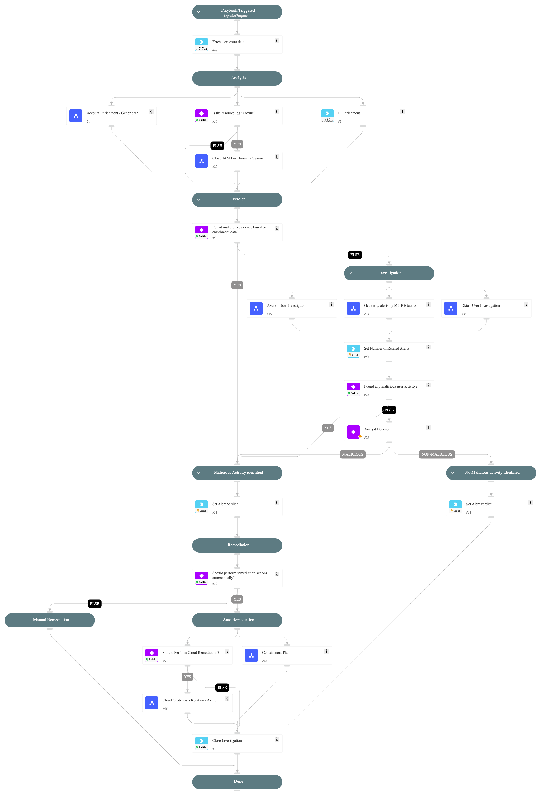

The `Identity Analytics - Alert Handling` playbook is designed to handle Identity Analytics alerts and executes the following:

Analysis:
- Enriches the IP and the account, providing additional context and information about these indicators.

Verdict:
- Determines the appropriate verdict based on the data collected from the enrichment phase.

Investigation:
- Checks for related XDR alerts to the user by Mitre tactics to identify malicious activity.
- Checks for specific arguments for malicious usage from Okta using the 'Okta User Investigation' sub-playbook.
- Checks for specific arguments for malicious usage from Azure using the 'Azure User Investigation' sub-playbook.

Verdict Handling:
- Handles malicious alerts by initiating appropriate response actions, including blocking malicious IP and revoking or clearing user's sessions.
- Handles non-malicious alerts identified during the investigation.

## Dependencies

This playbook uses the following sub-playbooks, integrations, and scripts.

### Sub-playbooks

* Cloud IAM Enrichment - Generic
* Azure - User Investigation
* Cloud Credentials Rotation - Azure
* Containment Plan
* Okta - User Investigation
* Account Enrichment - Generic v2.1
* Get entity alerts by MITRE tactics

### Integrations

* CortexCoreIR
* CoreIOCs

### Scripts

* SetAndHandleEmpty
* Set

### Commands

* closeInvestigation
* ip
* core-get-cloud-original-alerts

## Playbook Inputs

---

| **Name** | **Description** | **Default Value** | **Required** |
| --- | --- | --- | --- |
| RelatedAlertsThreshold | This is the minimum threshold for XSIAM related alerts, based on MITRE tactics used to identify malicious activity by the user in the last 1 day. Example: If this input is set to '5' and it detects '6' XSIAM related alerts, it will classify this check as indicating malicious activity. The default value is '5'. | 5 | Optional |
| FailedLogonThreshold | This is the minimum threshold for user login failures within the last 1 day. example: If this input is set to '30', and the 'Okta - User Investigation' or the 'Azure - User Investigation' sub-playbooks have found 31 failed login attempts - It will classify this behavior as malicious activity. The default value is '30'. | 30 | Optional |
| OktaSuspiciousEventsThreshold | This is the minimum threshold for suspicious Okta activity events by the user in the last 1 day. example: If this input is set to '5', and the 'Okta - User Investigation' sub-playbooks have found 6 events of suspicious activity by the user - It will classify this behavior as malicious activity. The default value is '5'. | 5 | Optional |
| AzureMfaFailedLogonThreshold | This is the minimum threshold for MFA failed logins by the user in the last 1 day. Required to determine how many MFA failed logon events count as malicious events. | 10 | Optional |
| AutoRemediation | Whether to execute the remediation flow automatically. Possible values are: "True" and "False". | False | Optional |
| AutoContainment | Whether to execute containment plan \(except isolation\) automatically. Possible values are: "True" and "False". | False | Optional |
| UserContainment | Whether to disable the user account using the 'Containment Plan' su-playbook. Possible values are: "True" and "False". | False | Optional |
| ClearUserSessions | Whether to clear the user's active Okta sessions using the 'Containment Plan' su-playbook. Possible values are: "True" and "False". | True | Optional |
| IAMRemediationType | The response on 'Cloud Credentials Rotation - Azure' sub-playbook provides the following remediation actions using MSGraph Users:  Reset: By entering "Reset" in the input, the playbook will execute password reset.  Revoke: By entering "Revoke" in the input, the playbook will revoke the user's session.  ALL: By entering "ALL" in the input, the playbook will execute the reset password and revoke session tasks. | Revoke | Optional |

## Playbook Outputs

---
There are no outputs for this playbook.

## Playbook Image

---

