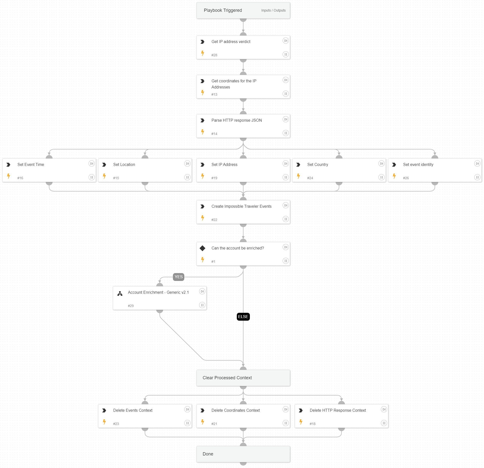

This playbook get as an input all of the involved IP addresses and identities from the Impossible Traveler playbook alert, and enriches them based on the following:
* Geo location
* Active Directory
* IP enrichment e.g. VirusTotal, AbuseIPDB, etc.

## Dependencies
This playbook uses the following sub-playbooks, integrations, and scripts.

### Sub-playbooks
* Active Directory - Get User Manager Details

### Integrations
* CoreIOCs
* CortexCoreIR

### Scripts
* http
* ParseJSON
* DeleteContext
* Set

### Commands
* ip
* ad-get-user

## Playbook Inputs
---

| **Name** | **Description** | **Default Value** | **Required** |
| --- | --- | --- | --- |
| sourceip | The source IP to iterate over. |  | Optional |

## Playbook Outputs
---

| **Path** | **Description** | **Type** |
| --- | --- | --- |
| UserManagerEmail | The email of the user's manager. | unknown |

## Playbook Image
---
