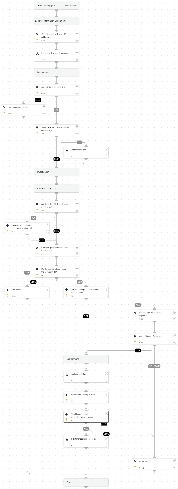

This playbook handles impossible traveler alerts.

An Impossible Traveler event occurs when multiple login attempts seen for a user from multiple remote countries in a short period of time, which shouldn't be possible. This may indicate the account is compromised.

**Attacker's Goals:**

Gain user-account credentials.

**Investigative Actions:**

Investigate the IP addresses and identities involved in the detected activity using:

* Impossible Traveler - Enrichment playbook
* CalculateGeoDistance automation

**Response Actions**

The playbook's first response actions are based on the data available within the alert. In that phase, the playbook will execute:

* Manual block indicators if the IP address found malicious
* Manual disable user
* Manual clear of the user’s sessions (Okta)

When the playbook continues, after validating the activity with the user’s manager, another phase of response actions is being executed, which includes:

* Auto block indicators 

**External Resources:**

[Impossible traveler alert](https://docs-cortex.paloaltonetworks.com/r/Cortex-XDR-Analytics-Alert-Reference/Impossible-traveler-SSO)

## Dependencies

This playbook uses the following sub-playbooks, integrations, and scripts.

### Sub-playbooks

* Containment Plan
* Impossible Traveler - Enrichment
* Ticket Management - Generic

### Integrations

This playbook does not use any integrations.

### Scripts

* impossibleTravelerGetDistance
* Set
* CreateArray

### Commands

* closeInvestigation
* setParentIncidentFields

## Playbook Inputs

---

| **Name** | **Description** | **Default Value** | **Required** |
| --- | --- | --- | --- |
| MaxMilesPerHourAllowed | The maximum miles per hour that is considered reasonable. If the geographical distance and difference in time between logins is greater than this value, the user will be considered an impossible traveler. | 400 | Optional |
| WhitelistedIPs | A comma separated list of IP addresses that are allowed to be used across long distances. |  | Optional |
| ContactUserManager | Whether to ask the user manager for the legitimacy of the login events, in case of an alleged impossible traveler. | True | Optional |
| AutoContainment | Whether to execute auto containment. | False | Optional |
| AbuseIPDBThreshold | The score needed from AbuseIPDB to consider IP address as malicious. | 80 | Optional |
| preInvestigationContainment | Whether to execute containment prior investigation phase |  | Optional |
| AllowlistCIDR | A comma separated list of CIDR that are allowed to be used across long distances. | lists.CIDR - Allowlist | Optional |
| username | The username to iterate over. | alert.username | Optional |
| domain | The organization domain. |  | Optional |
| ShouldOpenTicket | Whether to open a ticket automatically in a ticketing system. \(True/False\). | False | Optional |
| serviceNowShortDescription | A short description of the ticket. | XSIAM Incident ID - ${parentIncidentFields.incident_id} | Optional |
| serviceNowImpact | The impact for the new ticket. Leave empty for ServiceNow default impact. |  | Optional |
| serviceNowUrgency | The urgency of the new ticket. Leave empty for ServiceNow default urgency. |  | Optional |
| serviceNowSeverity | The severity of the new ticket. Leave empty for ServiceNow default severity. |  | Optional |
| serviceNowTicketType | The ServiceNow ticket type. Options are "incident", "problem", "change_request", "sc_request", "sc_task", or "sc_req_item". Default is "incident". |  | Optional |
| serviceNowCategory | The category of the ServiceNow ticket. |  | Optional |
| serviceNowAssignmentGroup | The group to which to assign the new ticket. |  | Optional |
| ZendeskPriority | The urgency with which the ticket should be addressed. Allowed values are "urgent", "high", "normal", or "low". |  | Optional |
| ZendeskRequester | The user who requested this ticket. |  | Optional |
| ZendeskStatus | The state of the ticket. Allowed values are "new", "open", "pending", "hold", "solved", or "closed". |  | Optional |
| ZendeskSubject | The value of the subject field for this ticket. | XSIAM Incident ID - ${parentIncidentFields.incident_id} | Optional |
| ZendeskTags | The array of tags applied to this ticket. |  | Optional |
| ZendeskType | The type of this ticket. Allowed values are "problem", "incident", "question", or "task". |  | Optional |
| ZendeskAssigne | The agent currently assigned to the ticket. |  | Optional |
| ZendeskCollaborators | The users currently CC'ed on the ticket. |  | Optional |
| description | The ticket description. | ${parentIncidentFields.description}. ${parentIncidentFields.xdr_url} | Optional |
| addCommentPerEndpoint | Whether to append a new comment to the ticket for each endpoint in the incident. Possible values: True/False. | True | Optional |
| CommentToAdd | Comment for the ticket. | ${alert.name}. Alert ID: ${alert.id} | Optional |

## Playbook Outputs

---

| **Path** | **Description** | **Type** |
| --- | --- | --- |
| Account.Email.Address | The email address object associated with the Account. | string |
| DBotScore | Indicator, Score, Type, Vendor. | unknown |
| Account.ID | The unique Account DN \(Distinguished Name\). | string |
| Account.Username | The username of the Account. | string |
| Account.Email | The email address associated with the Account. | unknown |
| Account.Type | The type of the Account entity. | string |
| Account.Groups | The groups that the Account is a part of. | unknown |
| Account | Account object | unknown |
| Account.DisplayName | The display name of the Account. | string |
| Account.Manager | The manager of the Account. | string |
| DBotScore.Indicator | The indicator value. | string |
| DBotScore.Type | The indicator's type. | string |
| DBotScore.Vendor | The indicator's vendor. | string |
| DBotScore.Score | The indicator's score. | number |
| IP | The IP objects. | unknown |
| Endpoint | The Endpoint's object. | unknown |
| Endpoint.Hostname | The hostname to enrich. | string |
| Endpoint.OS | The Endpoint OS. | string |
| Endpoint.IP | The list of Endpoint IP addresses. | unknown |
| Endpoint.MAC | The list of Endpoint MAC addresses. | unknown |
| Endpoint.Domain | The domain name of the Endpoint. | string |

## Playbook Image

---

