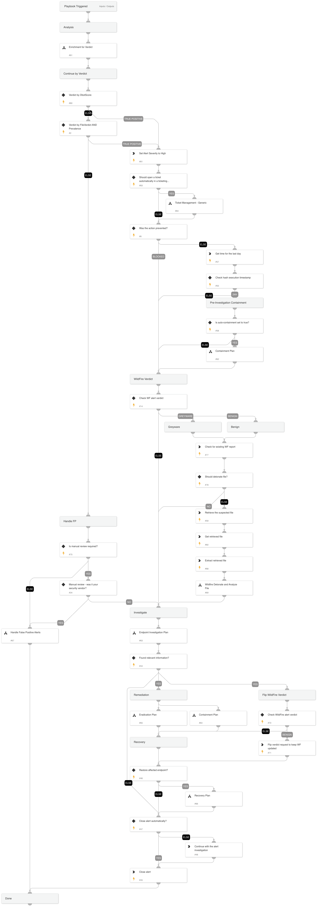

When an unknown executable, DLL, or macro attempts to run on a Windows or Mac endpoint, the Cortex XDR agent uses local analysis to determine if it is likely to be malware. Local analysis uses a static set of pattern-matching rules that inspect multiple file features and attributes, and a statistical model that was developed with machine learning on WildFire threat intelligence.

**Investigative Actions:**

Investigate the executed process image and verify if it is malicious using:

* XDR trusted signers
* VT trusted signers
* VT detection rate
* NSRL DB

**Response Actions**

The playbook's first response action is a containment plan that is based on the initial data provided within the alert. In that phase, the playbook will execute:

* Auto block indicators
* Auto file quarantine
* Manual endpoint isolation

When the playbook executes, it checks for additional activity using the Endpoint Investigation Plan playbook, and another phase, which includes containment and eradication, is executed.

This phase will execute the following containment actions:

* Manual block indicators
* Manual file quarantine
* Auto endpoint isolation

And the following eradication actions:

* Manual process termination
* Manual file deletion
* Manual reset of the user’s password

External resources:

[Malware Protection Flow](https://docs-cortex.paloaltonetworks.com/r/Cortex-XSIAM/Cortex-XSIAM-Administrator-Guide/File-Analysis-and-Protection-Flow)

## Dependencies

This playbook uses the following sub-playbooks, integrations, and scripts.

### Sub-playbooks

* Handle False Positive Alerts
* Enrichment for Verdict
* Ticket Management - Generic
* Eradication Plan
* Wildfire Detonate and Analyze File
* Containment Plan
* Endpoint Investigation Plan
* Recovery Plan

### Integrations

* CortexCoreIR

### Scripts

* UnzipFile
* GetTime

### Commands

* core-report-incorrect-wildfire
* core-retrieve-file-details
* internal-wildfire-get-report
* closeInvestigation
* setParentIncidentFields
* core-retrieve-files

## Playbook Inputs

---

| **Name** | **Description** | **Default Value** | **Required** |
| --- | --- | --- | --- |
| GraywareAsMalware | Whether to treat Grayware verdict as Malware.  | False | Optional |
| AutoContainment | Setting this input will impact both Containment Plan sub-playbooks. Without setting this input, the default values are True for the first occurrence and False for the second. Whether to execute automatically or manually the containment plan tasks: \* Isolate endpoint \* Block indicators \* Quarantine file \* Disable user | True | Optional |
| AutoEradication | Whether to execute automatically or manually the eradication plan tasks: \* Terminate process \* Delete file \* Reset the user's password | False | Optional |
| FileRemediation | Should be either 'Quarantine' or 'Delete'. | Quarantine | Optional |
| AutoRecovery | Whether to execute the Recovery playbook. | False | Optional |
| AutoCloseAlert | Whether to close the alert automatically or manually, after an analyst's review. | False | Optional |
| ShouldRescanBenign | Whether to rescan \(Using WildFire detonate file\) benign files. | True | Optional |
| ShouldManualReviewFP | Whether to ask for a manual review before false positive handling. Should be True or False | False | Optional |
| SHA256 | The SHA256 hash of the file to respond to. Decided by the DT expression wether it's the initiator or the target file SHA256. | alert | Optional |
| Path | The path of the file to respond to. Decided by the DT expression wether it's the initiator or the target file path. | alert | Optional |
| Query | The query for searching previous alerts based on the file we want to respond to. Decided by the If-Then-Else expression wether it's the initiator or the target file. | alert | Optional |
| ShouldOpenTicket | Whether to open a ticket automatically in a ticketing system. \(True/False\). | False | Optional |
| serviceNowShortDescription | A short description of the ticket. | XSIAM Incident ID - ${parentIncidentFields.incident_id} | Optional |
| serviceNowImpact | The impact for the new ticket. Leave empty for ServiceNow default impact. |  | Optional |
| serviceNowUrgency | The urgency of the new ticket. Leave empty for ServiceNow default urgency. |  | Optional |
| serviceNowSeverity | The severity of the new ticket. Leave empty for ServiceNow default severity. |  | Optional |
| serviceNowTicketType | The ServiceNow ticket type. Options are "incident", "problem", "change_request", "sc_request", "sc_task", or "sc_req_item". Default is "incident". |  | Optional |
| serviceNowCategory | The category of the ServiceNow ticket. |  | Optional |
| serviceNowAssignmentGroup | The group to which to assign the new ticket. |  | Optional |
| ZendeskPriority | The urgency with which the ticket should be addressed. Allowed values are "urgent", "high", "normal", or "low". |  | Optional |
| ZendeskRequester | The user who requested this ticket. |  | Optional |
| ZendeskStatus | The state of the ticket. Allowed values are "new", "open", "pending", "hold", "solved", or "closed". |  | Optional |
| ZendeskSubject | The value of the subject field for this ticket. | XSIAM Incident ID - ${parentIncidentFields.incident_id} | Optional |
| ZendeskTags | The array of tags applied to this ticket. |  | Optional |
| ZendeskType | The type of this ticket. Allowed values are "problem", "incident", "question", or "task". |  | Optional |
| ZendeskAssigne | The agent currently assigned to the ticket. |  | Optional |
| ZendeskCollaborators | The users currently CC'ed on the ticket. |  | Optional |
| description | The ticket description. | ${parentIncidentFields.description}. ${parentIncidentFields.xdr_url} | Optional |
| addCommentPerEndpoint | Whether to append a new comment to the ticket for each endpoint in the incident. Possible values: True/False. |  | Optional |
| CommentToAdd | Comment for the ticket. | ${alert.name}. Alert ID: ${alert.id} | Optional |

## Playbook Outputs

---
There are no outputs for this playbook.

## Playbook Image

---

