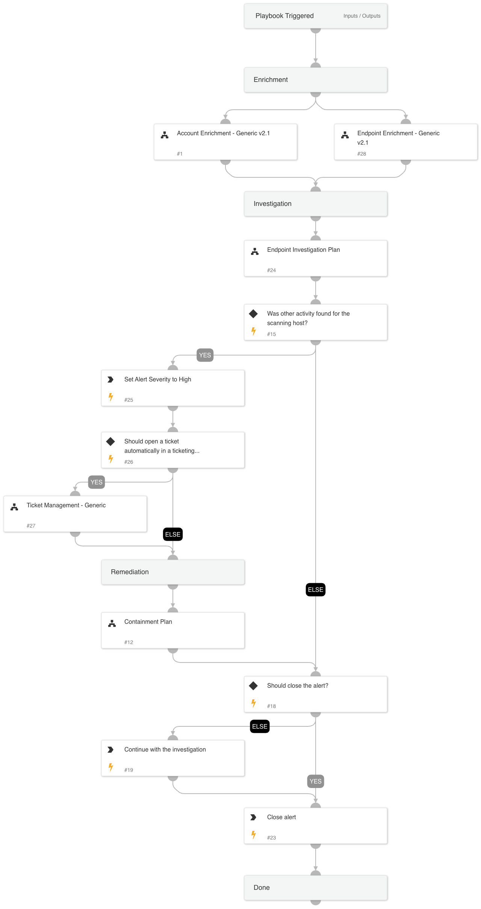

This playbook investigates a scan where the source is an internal IP address.

An attacker might initiate an internal scan for discovery, lateral movement and more.

**Attacker's Goals:**

An attacker can leverage a scan for open ports and vulnerable systems on remote endpoints in an attempt to identify the endpoint operating system, firewall configuration, and exploitable services.

**Investigative Actions:**

* Endpoint Investigation Plan playbook

**Response Actions**

The playbook's response actions are based on the Endpoint Investigation Plan playbook results. In that phase, the playbook will execute:

* Auto endpoint isolation
* Manual block indicators
* Manual file quarantine

## Dependencies

This playbook uses the following sub-playbooks, integrations, and scripts.

### Sub-playbooks

* Account Enrichment - Generic v2.1
* Ticket Management - Generic
* Containment Plan
* Endpoint Investigation Plan
* Endpoint Enrichment - Generic v2.1

### Integrations

This playbook does not use any integrations.

### Scripts

This playbook does not use any scripts.

### Commands

* closeInvestigation
* setParentIncidentFields

## Playbook Inputs

---

| **Name** | **Description** | **Default Value** | **Required** |
| --- | --- | --- | --- |
| scannerIP | The scanner IP address | alert.hostip | Optional |
| AutoCloseAlert | Whether to close the alert automatically or manually, after an analyst's review. | false | Optional |
| AutoContainment | Whether to execute automatically or manually the containment plan tasks: \* Block indicators \* Quarantine file \* Disable user |  | Optional |
| HostAutoContainment | Whether to execute endpoint isolation automatically or manually. |  | Optional |
| ShouldOpenTicket | Whether to open a ticket automatically in a ticketing system. \(True/False\). | False | Optional |
| serviceNowShortDescription | A short description of the ticket. | XSIAM Incident ID - ${parentIncidentFields.incident_id} | Optional |
| serviceNowImpact | The impact for the new ticket. Leave empty for ServiceNow default impact. |  | Optional |
| serviceNowUrgency | The urgency of the new ticket. Leave empty for ServiceNow default urgency. |  | Optional |
| serviceNowSeverity | The severity of the new ticket. Leave empty for ServiceNow default severity. |  | Optional |
| serviceNowTicketType | The ServiceNow ticket type. Options are "incident", "problem", "change_request", "sc_request", "sc_task", or "sc_req_item". Default is "incident". |  | Optional |
| serviceNowCategory | The category of the ServiceNow ticket. |  | Optional |
| serviceNowAssignmentGroup | The group to which to assign the new ticket. |  | Optional |
| ZendeskPriority | The urgency with which the ticket should be addressed. Allowed values are "urgent", "high", "normal", or "low". |  | Optional |
| ZendeskRequester | The user who requested this ticket. |  | Optional |
| ZendeskStatus | The state of the ticket. Allowed values are "new", "open", "pending", "hold", "solved", or "closed". |  | Optional |
| ZendeskSubject | The value of the subject field for this ticket. | XSIAM Incident ID - ${parentIncidentFields.incident_id} | Optional |
| ZendeskTags | The array of tags applied to this ticket. |  | Optional |
| ZendeskType | The type of this ticket. Allowed values are "problem", "incident", "question", or "task". |  | Optional |
| ZendeskAssigne | The agent currently assigned to the ticket. |  | Optional |
| ZendeskCollaborators | The users currently CC'ed on the ticket. |  | Optional |
| description | The ticket description. | ${parentIncidentFields.description}. ${parentIncidentFields.xdr_url} | Optional |
| addCommentPerEndpoint | Whether to append a new comment to the ticket for each endpoint in the incident. Possible values: True/False. | True | Optional |
| CommentToAdd | Comment for the ticket. | ${alert.name}. Alert ID: ${alert.id} | Optional |

## Playbook Outputs

---
There are no outputs for this playbook.

## Playbook Image

---

