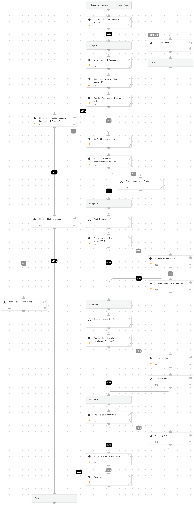

This playbook handles external and internal scanning alerts.

**Attacker's Goals:**

Adversaries may attempt to get a listing of services running on remote hosts, including those that may be vulnerable to remote software exploitation. Methods to acquire this information include port scans and vulnerability scans using tools that are brought onto a system.

**Investigative Actions:**

Investigate the scanner IP address using:

* IP enrichment:
* NGFW Internal Scan playbook
* Endpoint Investigation Plan playbook
* Entity enrichment

**Response Actions**

The playbook's response actions are based on the initial data provided within the alert. In that phase, the playbook will execute:

* Automatically block IP address
* Report IP address (If configured as true in the playbook inputs)

When the playbook executes, it checks for additional activity using the Endpoint Investigation Plan playbook, and another phase, which includes the Containment Plan playbook, is executed.
This phase will execute the following containment actions:

* Automatically isolate involved endpoint
* Manual block indicators
* Manual file quarantine
* Manual disable user

**External resources:**

[Mitre technique T1046 - Network Service Scanning](https://attack.mitre.org/techniques/T1046/)

[Port Scan](https://docs-cortex.paloaltonetworks.com/r/Cortex-XDR-Analytics-Alert-Reference/Port-Scan)

## Dependencies

This playbook uses the following sub-playbooks, integrations, and scripts.

### Sub-playbooks

* Handle False Positive Alerts
* NGFW Internal Scan
* Block IP - Generic v3
* Endpoint Investigation Plan
* Containment Plan
* Recovery Plan
* Ticket Management - Generic

### Integrations

* CoreIOCs
* CortexCoreIR

### Scripts

* SearchIncidentsV2

### Commands

* closeInvestigation
* abuseipdb-report-ip
* ip
* send-mail
* setParentIncidentFields

## Playbook Inputs

---

| **Name** | **Description** | **Default Value** | **Required** |
| --- | --- | --- | --- |
| scannerIP | The scanner IP address. | alert.localip | Optional |
| blockKnownScanner | Whether to block the IP address based on previously seen scanning alerts. | true | Optional |
| AutoCloseAlert | Whether to close the alert automatically or manually, after an analyst's review. | false | Optional |
| AutoRecovery | Whether to execute the Recovery playbook. | false | Optional |
| SOCEmailAddress | The SOC email address. |  | Optional |
| reportIPAddress | Whether to report the IP address to AbuseIPDB. | false | Optional |
| AutoContainment | Whether to execute automatically or manually the containment plan tasks: \* Block indicators \* Quarantine file \* Disable user | false | Optional |
| HostAutoContainment | Whether to execute endpoint isolation automatically or manually. | false | Optional |
| ShouldOpenTicket | Whether to open a ticket automatically in a ticketing system. \(True/False\). | False | Optional |
| serviceNowShortDescription | A short description of the ticket. | XSIAM Incident ID - ${parentIncidentFields.incident_id} | Optional |
| serviceNowImpact | The impact for the new ticket. Leave empty for ServiceNow default impact. |  | Optional |
| serviceNowUrgency | The urgency of the new ticket. Leave empty for ServiceNow default urgency. |  | Optional |
| serviceNowSeverity | The severity of the new ticket. Leave empty for ServiceNow default severity. |  | Optional |
| serviceNowTicketType | The ServiceNow ticket type. Options are "incident", "problem", "change_request", "sc_request", "sc_task", or "sc_req_item". Default is "incident". |  | Optional |
| serviceNowCategory | The category of the ServiceNow ticket. |  | Optional |
| serviceNowAssignmentGroup | The group to which to assign the new ticket. |  | Optional |
| ZendeskPriority | The urgency with which the ticket should be addressed. Allowed values are "urgent", "high", "normal", or "low". |  | Optional |
| ZendeskRequester | The user who requested this ticket. |  | Optional |
| ZendeskStatus | The state of the ticket. Allowed values are "new", "open", "pending", "hold", "solved", or "closed". |  | Optional |
| ZendeskSubject | The value of the subject field for this ticket. | XSIAM Incident ID - ${parentIncidentFields.incident_id} | Optional |
| ZendeskTags | The array of tags applied to this ticket. |  | Optional |
| ZendeskType | The type of this ticket. Allowed values are "problem", "incident", "question", or "task". |  | Optional |
| ZendeskAssigne | The agent currently assigned to the ticket. |  | Optional |
| ZendeskCollaborators | The users currently CC'ed on the ticket. |  | Optional |
| description | The ticket description. | ${parentIncidentFields.description}. ${parentIncidentFields.xdr_url} | Optional |
| addCommentPerEndpoint | Whether to append a new comment to the ticket for each endpoint in the incident. Possible values: True/False. | True | Optional |
| CommentToAdd | Comment for the ticket. | ${alert.name}. Alert ID: ${alert.id} | Optional |
| UserVerification | Possible values: True/False.  Default: True. Whether to provide user verification for blocking IP addresses. | True | Optional |

## Playbook Outputs

---
There are no outputs for this playbook.

## Playbook Image

---

