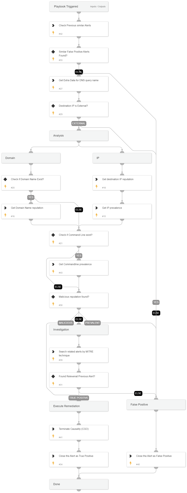

# Netcat Connection Alert Response Playbook

## Overview
This playbook is designed to automatically respond to "Netcat makes or gets connections" alerts. It checks for malicious reputation or previous related alerts, and takes appropriate action if necessary, such as killing the malicious process.

## Use Cases
- Detect and respond to potential network-based malicious activity using the Netcat tool.
- Investigate and mitigate the impact of Netcat-related security incidents.
- Streamline the response process for "Netcat makes or gets connections" alerts.

## Playbook Flow
1. **Trigger**: The playbook is triggered by a "Netcat makes or gets connections" alert.
2. **Check Reputation**: The playbook checks the reputation of the IP address or domain associated with the Netcat connection.
3. **Check Previous Alerts**: The playbook searches for any previous related alerts.
4. **Evaluate Threat Level**: Based on the reputation and previous alert information, the playbook determines the threat and if a response action is needed.
5. **Respond and Mitigate**: If the threat level is deemed high, the playbook takes the following remediation action:
   - Killing the malicious process.

## Dependencies

This playbook uses the following sub-playbooks, integrations, and scripts.

### Sub-playbooks

This playbook does not use any sub-playbooks.

### Integrations

* CoreIOCs
* CortexCoreIR
* CortexCoreXQLQueryEngine

### Scripts

* DBotFindSimilarAlerts
* SearchAlertsV2

### Commands

* closeInvestigation
* core-get-IP-analytics-prevalence
* core-get-cloud-original-alerts
* core-get-cmd-analytics-prevalence
* core-terminate-causality
* domain
* ip

## Playbook Inputs

---

| **Name** | **Description** | **Default Value** | **Required** |
| --- | --- | --- | --- |
| InternalRange | A list of internal IP ranges to check IP addresses against. The comma-separated list should be provided in CIDR notation. For example, a list of ranges would be: "172.16.0.0/12,10.0.0.0/8,192.168.0.0/16" \(without quotes\). | lists.PrivateIPs | Optional |

## Playbook Outputs

---
There are no outputs for this playbook.

## Playbook Image

---

