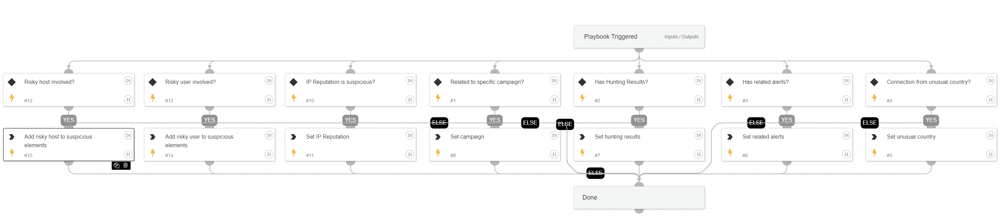

This playbook creating an array called "Suspicious Elements", which is used to count potential security threats. The following elements can be added to the array:

- "IP Reputation" - Dbot Score is 2-3 
- "Source geolocation" - RDP Connection made from rare geo-location 
-  Related to campaign - IP address is related to campaign, based on TIM module
-  Hunting results - the hunt for indicators related to the source IP and the related campaign returned results
-  XDR Alert search - XDR Alerts that related to the same username and endpoint, and to the MITRE tactics that comes after "Credential Access", were found.

The array will then be outputted and its size will be compared to a final threshold. If the size is greater than or equal to the threshold, the investigation's final verdict will be deemed a "True Positive."

## Dependencies

This playbook uses the following sub-playbooks, integrations, and scripts.

### Sub-playbooks

This playbook does not use any sub-playbooks.

### Integrations

This playbook does not use any integrations.

### Scripts

* Set

### Commands

This playbook does not use any commands.

## Playbook Inputs

---

| **Name** | **Description** | **Default Value** | **Required** |
| --- | --- | --- | --- |
| RelatedAlerts | Number of XDR alerts that are related to the same user or endpoint. |  | Optional |
| RelatedCampaign | Campaign related to the external IP. |  | Optional |
| HuntResults | Determine whether hunting results exist. The input value should be true or false. |  | Optional |
| UnusualGeoLocation |  determine whether the RDP connection has made RDP Connection made from rare geo-location. the input value should be true or false. |  | Optional |
| IpReputation | The external IP reputation. |  | Optional |

## Playbook Outputs

---

| **Path** | **Description** | **Type** |
| --- | --- | --- |
| Suspicious_Elements | Array that contains all the suspicious elements. | unknown |

## Playbook Image

---

