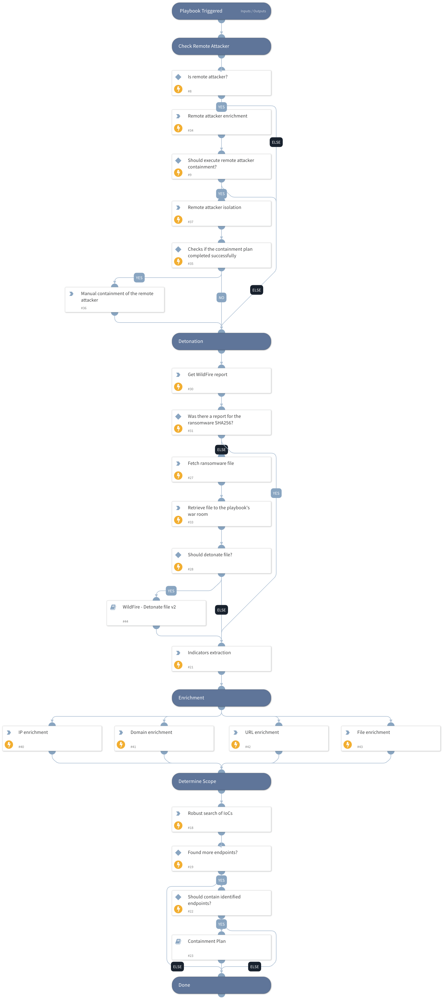

This playbook is responsible for ransomware alert data enrichment and response.
The playbook executes the following:

1. Checks if the initiator is a remote attacker and allows isolating the remote host, if possible.

2. Retrieves the WildFire sandbox report and extracts the indicators within it.
    * The playbook tries to retrieve the report, but if there is no report available, the playbook tries to fetch the ransomware file for detonation.

3. Hunts for the ransomware alert indicators from the alert table, searches for endpoints that have been seen with them, and allows containing the identified endpoints.

## Dependencies

This playbook uses the following sub-playbooks, integrations, and scripts.

### Sub-playbooks

* WildFire - Detonate file v2
* Containment Plan

### Integrations

* CoreIOCs
* CortexCoreIR

### Scripts

* isError
* SearchIncidentsV2

### Commands

* extractIndicators
* core-isolate-endpoint
* core-retrieve-file-details
* domain
* file
* ip
* core-retrieve-files
* url
* wildfire-report
* core-get-endpoints

## Playbook Inputs

---

| **Name** | **Description** | **Default Value** | **Required** |
| --- | --- | --- | --- |
| isolateRemoteAttacker | Whether to isolate the remote attacker host. | true | Optional |
| isolateSimilarEndpoints | Whether to isolate endpoints which has been detected with the alert IoCs. | false | Optional |
| FileSHA256 | The ransomware file SHA256. | alert.initiatorsha256 | Optional |
| detonateRansomFile | Whether to detonate the ransomware file in sandbox, Set to True to enable file detonation and False to disable it. By default is set to True. | True | Optional |

## Playbook Outputs

---
There are no outputs for this playbook.

## Playbook Image

---

