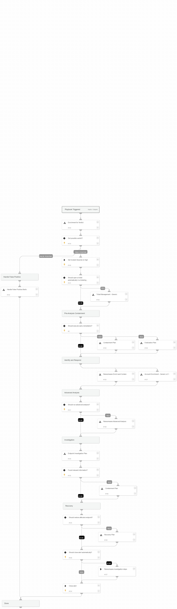

This playbook handles ransomware alerts based on the Cortex XDR Traps module signature 'Suspicious File Modification'

**Attacker’s Goals:**

An attacker is attempting to encrypt the victim files for either extortion or destruction purposes.

**Investigative Actions:**

Investigate the executed process image and verify if it is malicious using:

* XDR trusted signers

* VT trusted signers

* VT detection rate

* NSRL DB

**Response Actions:**

The playbook’s first response action is a remediation plan which includes two sub-playbooks, **Containment Plan** and **Eradication Plan**, which is based on the initial data provided within the alert. In that phase, the playbooks will execute:

* Auto endpoint isolation

* Auto block indicators

* Auto file quarantine

* Auto user disable

* Auto process termination

Next, the playbook executes an enrichment and response phase which includes two sub-playbooks, **Ransomware Enrich and Contain** & **Account Enrichment - Generic v2.1**.
The Ransomware Enrich and Contain playbook does the following:

1.Checks if the initiator is a remote attacker and allows isolating the remote host, if possible. 

2.Retrieves the WildFire sandbox report and extracts the indicators within it. * The playbook tries to retrieve the report, but if there is no report available, the playbook tries to fetch the ransomware file for detonation. 

3.Hunts for the ransomware alert indicators from the alert table, searches for endpoints that have been seen with them, and allows containing the identified endpoints.

Next, an advanced analysis playbook, which is currently done mostly manually, will be executed. This sub-playbook, **Ransomware Advanced Analysis** allows the analyst to upload the ransomware note and for the ransomware identification. Using the **ID-Ransomware** service, the analyst will be able to get the ransomware type and the decryptor if available.

When the playbook executes, it checks for additional activity using the Endpoint Investigation Plan playbook, and another phase, which includes the Containment Plan sub-playbook, is executed.

**This phase will execute the following containment actions:**

* Manual block indicators

* Manual file quarantine

* Auto endpoint isolation

Finally, the recovery phase is executed. If the analysts decides to continue with the investigation rather than recover and close the alert, a manual task with **CISA** official ransomware investigation checklist is provided for further investigation.

**External resources:**

[MITRE Technique T1486](https://attack.mitre.org/techniques/T1486/)

[CISA Ransomware Guide](https://www.cisa.gov/stopransomware/ransomware-guide)

## Dependencies

This playbook uses the following sub-playbooks, integrations, and scripts.

### Sub-playbooks

* Endpoint Investigation Plan
* Enrichment for Verdict
* Recovery Plan
* Ransomware Advanced Analysis
* Handle False Positive Alerts
* Containment Plan
* Ransomware Enrich and Contain
* Account Enrichment - Generic v2.1
* Eradication Plan

### Integrations

This playbook does not use any integrations.

### Scripts

This playbook does not use any scripts.

### Commands

* closeInvestigation

## Playbook Inputs

---

| **Name** | **Description** | **Default Value** | **Required** |
| --- | --- | --- | --- |
| earlyRemediation | Whether to execute the early remediation phase. | True | Optional |
| AutoContainment | Whether to execute the containment actions automatically. | True | Optional |
| AutoEradication | Whether to execute the eradication actions automatically. | True | Optional |
| isolateRemoteAttacker | Whether to isolate the remote endpoint if the attack has been triggered remotely. | True | Optional |
| isolateSimilarEndpoints | Whether to isolate the endpoints identified with similar IoCs to the ransomware alert. | True | Optional |
| RunAdvancedAnalysis | Whether to execute the Ransomware Advanced Analysis playbook.  Note that advanced analysis contains manual tasks which will stop the playbook's flow until the analysts's response. | True | Optional |
| ShouldCloseAutomatically | Whether to close the alert automatically. | False | Optional |
| FileSHA256 | The file SHA256 to investigate. | alert.initiatorsha256 | Optional |
| FilePath | The file path to investigate. | alert.initiatorpath | Optional |
| IP | The IP address to investigate. | alert.hostip | Optional |

## Playbook Outputs

---
There are no outputs for this playbook.

## Playbook Image

---

