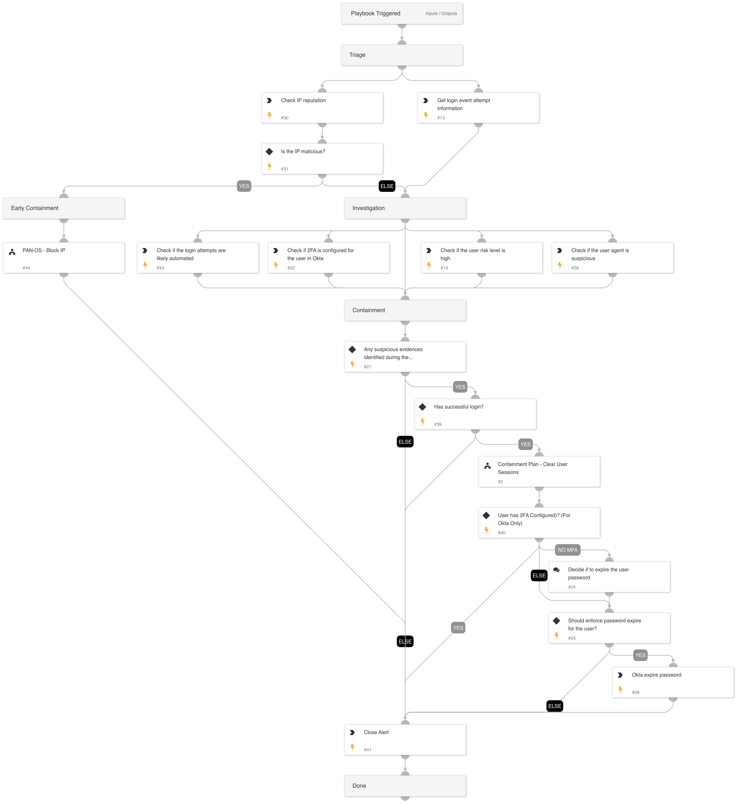

This playbook is designed to address the following alerts:

- SSO Brute Force Threat Detected
- SSO Brute Force Activity Observed

Playbook Stages:
Triage:

- The playbook will check the IP reputation and will fetch the events related to the brute force login attempts.

Early Containment:

- The playbook will check if the IP is suspicious. If it is, the playbook will suggest blocking the IP using PAN-OS. The investigation will continue in parallel to this phase.

Investigation:

- The playbook will assess the risk score of the user who successfully logged in after a brute force attempt, examine the legitimacy of the user agent and if the brute force attempt is likely automated based on the timestamp interval. It will also verify if the user has MFA configured when the alert source is Okta.

Containment:
- If one of the following evidences is identified:

The user's risk score is high
The user agent is detected as suspicious
The time intervals indicates that the login attempts is likely automated

and there is a successful login attempt, the playbook will clear the user's session. If the user doesn't have MFA configured, the playbook will recommend expiring the user's password. If there is no successful login detected, no action will be taken.

Requirements:

For any response action, you will need one of the following integrations:

- Microsoft Graph User
- Okta v2

For eradication step,  you will need the following integration:

- Palo Alto Networks PAN-OS.

## Dependencies

This playbook uses the following sub-playbooks, integrations, and scripts.

### Sub-playbooks

* Containment Plan - Clear User Sessions
* PAN-OS - Block IP

### Integrations

* Cortex Core - IR

### Scripts

* AnalyzeTimestampIntervals
* MatchRegexV2

### Commands

* okta-get-user-factors
* okta-expire-password
* core-get-cloud-original-alerts
* core-list-risky-users
* closeInvestigation
* ip

## Playbook Inputs

---
There are no inputs for this playbook.

## Playbook Outputs

---
There are no outputs for this playbook.

## Playbook Image

---

