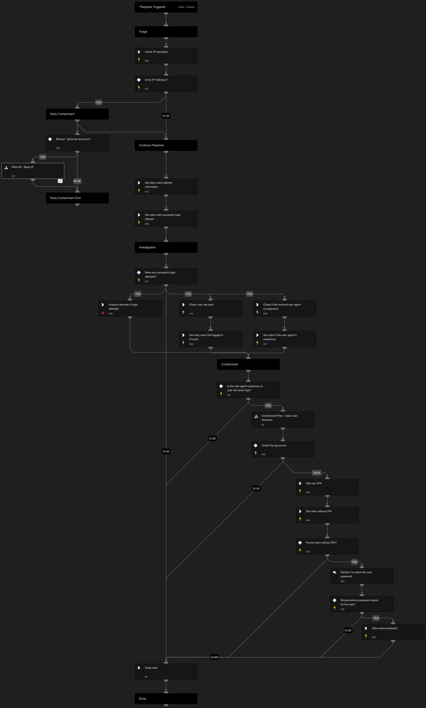

Playbook Overview:
This playbook is designed to address the following alerts:
- SSO Password Spray Threat Detected
- SSO Password Spray Activity Observed
- SSO Password Spray Involving a Honey User

Early Containment:
The playbook will check if the IP is external and suspicious. If it is, the playbook will suggest blocking the IP.

Investigation:
The playbook will assess the risk score of the user who successfully logged in and examine the legitimacy of the user agent. It will also verify if the user has MFA configured.

Containment:
If there is a successful login attempt and the user's risk score is high, or if the user agent is detected as suspicious, or if the time intervals were automated, the playbook will clear the user's session. If the user doesn't have 2FA, the playbook will recommend expiring the user's password.

For any response action, you will need one of the following integrations:

Microsoft Graph User
Okta.

## Dependencies

This playbook uses the following sub-playbooks, integrations, and scripts.

### Sub-playbooks

* PAN-OS - Block IP
* Containment Plan - Clear User Sessions

### Integrations

* CoreIOCs
* CortexCoreXQLQueryEngine
* CortexCoreIR

### Scripts

* AnalyzeTimestampIntervals
* SetAndHandleEmpty

### Commands

* okta-expire-password
* core-get-cloud-original-alerts
* core-list-risky-users
* ip
* okta-get-user-factors
* closeInvestigation

## Playbook Inputs

---
There are no inputs for this playbook.

## Playbook Outputs

---
There are no outputs for this playbook.

## Playbook Image

---

