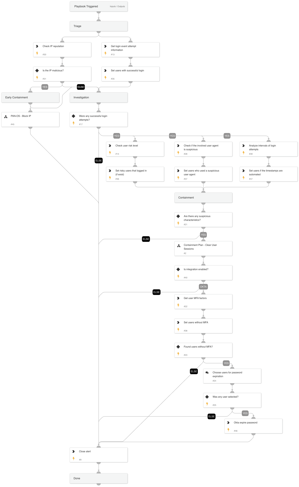

Playbook Overview:

This playbook is designed to handle the following alerts:

- SSO Password Spray Threat Detected
- SSO Password Spray Activity Observed
- SSO Password Spray Involving a Honey User

Early Containment: 

- Checks if the ip is external and suspicious, if yes the playbook will suggest to block the ip. 

Investigation: 

- The playbook will assess the risk score of the user that successfully logged in and examine the legitimacy of the user agent. The playbook checks if the user has MFA configured.

Containment: 

- If there is a successful login attempt and user’s risk score is high or the user agent is detected as suspicious or the time intervals were automated, the playbook will clear user's session and if the user doesn't have 2FA the playbook will recommend to expire the password for the user. 

For any response action, you will need one of the following integrations: 
- Microsoft Graph User
- Okta.

## Dependencies

This playbook uses the following sub-playbooks, integrations, and scripts.

### Sub-playbooks

* PAN-OS - Block IP
* Containment Plan - Clear User Sessions

### Integrations

* CortexCoreXQLQueryEngine
* CoreIOCs
* CortexCoreIR

### Scripts

* AnalyzeTimestampIntervals_v2
* SetAndHandleEmpty

### Commands

* okta-get-user-factors
* core-list-risky-users
* okta-expire-password
* core-get-cloud-original-alerts
* ip

## Playbook Inputs

---
There are no inputs for this playbook.

## Playbook Outputs

---
There are no outputs for this playbook.

## Playbook Image

---

