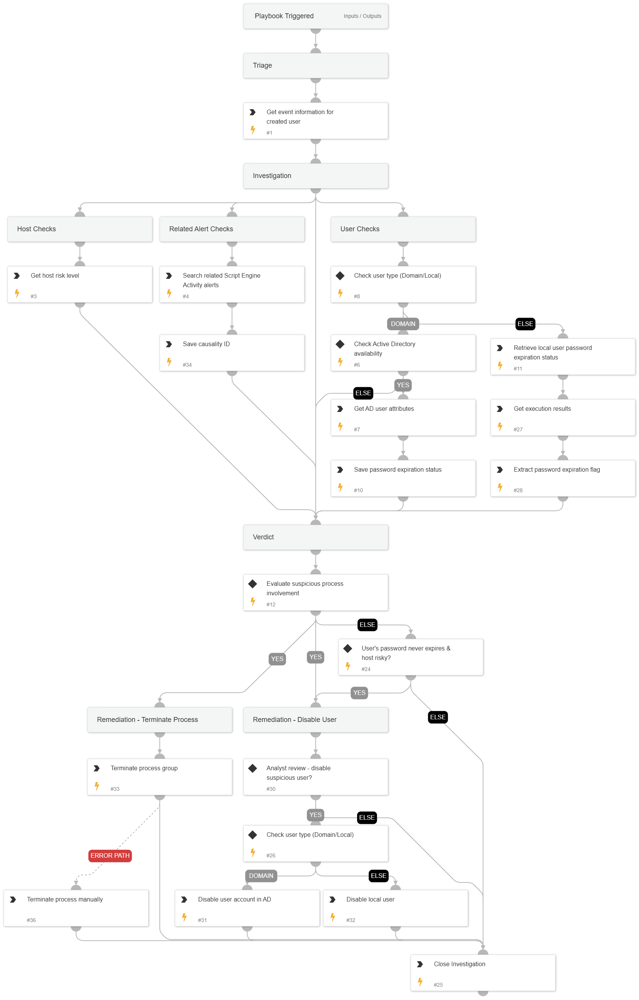

This playbook addresses the following alerts:

- Suspicious Hidden User Created

Playbook Stages:

Triage:

- Retrieve event information about the created user

Investigation:

- Check if the user is local or domain.
- For domain users: Retrieve AD attributes, including password expiration.
- For local users: Run a Powershell command to get "Password Expires" attribute of the local user.
- Get risk level for the affected host.
- Search for related Script Engine Activity alerts in the incident.

Containment:

- For alerts determined to be true positives, suggest to the analyst to disable the user.
- Upon analyst approval: Disable the suspicious user account (domain or local).
- If a related alert about malicious activity exists, kill the Causality Group Owner (CGO) process that created the suspicious user.

Requirements:

For response actions, you need the following integrations:

- Cortex Core - Investigation and Response
- Active Directory Query v2 (for domain user actions).

## Dependencies

This playbook uses the following sub-playbooks, integrations, and scripts.

### Sub-playbooks

This playbook does not use any sub-playbooks.

### Integrations

* CortexCoreIR

### Scripts

* IsIntegrationAvailable
* SearchAlertsV2
* SetAndHandleEmpty

### Commands

* ad-disable-account
* ad-get-user
* closeInvestigation
* core-get-cloud-original-alerts
* core-get-script-execution-results
* core-list-risky-hosts
* core-run-script-execute-commands
* core-terminate-causality

## Playbook Inputs

---
There are no inputs for this playbook.

## Playbook Outputs

---
There are no outputs for this playbook.

## Playbook Image

---

