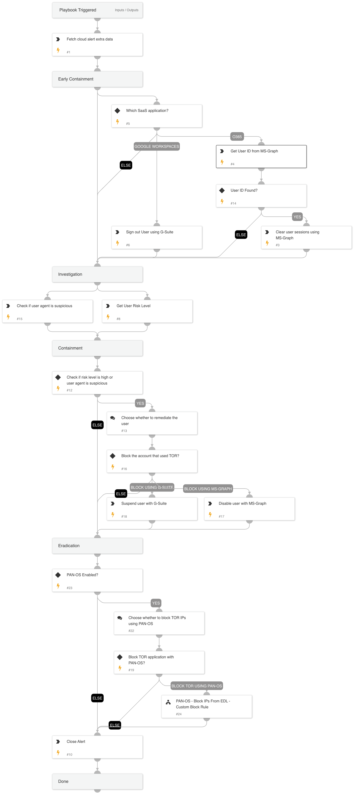

Playbook Overview:

This playbook is designed to handle the following alerts:

Suspicious SaaS API call from a Tor exit node
Suspicious SaaS API call from a Tor exit node via a mobile device
Suspicious API call from a Tor exit node
Suspicious Kubernetes API call from a Tor exit node
Playbook Stages:

Early Containment:
To terminate the connection from the Tor exit node, the playbook will clear/revoke the user's sessions and force re-authentication. Depending on the alert source, the playbook will use either MS-Graph or G-Suite to clear the user sessions.

Investigation:
The playbook will assess the risk score of the user connected from the Tor exit node and examine the legitimacy of the user agent.

Containment:
If the user's risk score is high or the user agent is detected as suspicious, the playbook will recommend blocking the account connected from the Tor exit node. The playbook will use MS-Graph, G-Suite, or AWS-IAM, depending on the alert source.

Eradication:
For users with PAN-OS enabled, the playbook will recommend blocking all IPs from the Palo Alto Intelligence-based external dynamic list that contains Tor exit nodes. The goal is to prevent the use of Tor within the organization.

Requirements:
For any response action, you will need one of the following integrations: Microsoft Graph User / G-Suite Admin / AWS-IAM.

## Dependencies

This playbook uses the following sub-playbooks, integrations, and scripts.

### Sub-playbooks

* PAN-OS - Block IPs From EDL - Custom Block Rule

### Integrations

* CortexCoreIR

### Scripts

* MatchRegexV2

### Commands

* msgraph-user-account-disable
* aws-iam-delete-login-profile
* msgraph-user-session-revoke
* closeInvestigation
* core-list-risky-users
* gsuite-user-signout
* gsuite-user-update
* msgraph-user-list
* core-get-cloud-original-alerts

## Playbook Inputs

---
There are no inputs for this playbook.

## Playbook Outputs

---
There are no outputs for this playbook.

## Playbook Image

---

