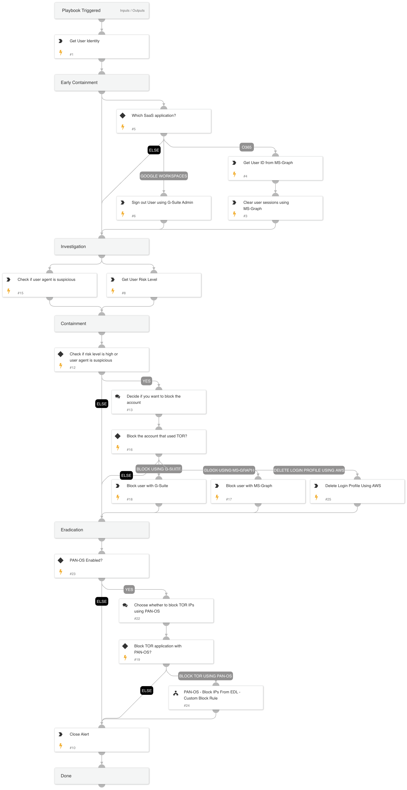

This playbook is designed to handle the following alerts: 
- Suspicious SaaS API call from a Tor exit node	
- Suspicious SaaS API call from a Tor exit node via a mobile device
- Suspicious API call from a Tor exit node
- Suspicious Kubernetes API call from a Tor exit node

The playbook executes the following stages:
Early Containment: Clear/revoke the user sessions and force re-authentication.
Investigation: Checks the user’s risk score. Checks for suspicious user agent usage within the alert.
Containment: Based on the user’s risk score and user agent, the playbook will suggest to block the account involved.
Eradication: For users with PAN-OS enabled, the playbook will suggest to block all IPs from Palo Alto Intelligence-based external dynamic list that contains TOR exit nodes.
Requires: Integrations - Microsoft Graph User / G-Suite Admin.

## Dependencies

This playbook uses the following sub-playbooks, integrations, and scripts.

### Sub-playbooks

PAN-OS - Block IPs From EDL - Custom Block Rule

### Integrations

CortexCoreIR

### Scripts

MatchRegexV2

### Commands

* gsuite-user-signout
* core-get-cloud-original-alerts
* msgraph-user-session-revoke
* gsuite-user-update
* msgraph-user-account-disable
* aws-iam-delete-login-profile
* closeInvestigation
* core-list-risky-users
* msgraph-user-list

## Playbook Inputs

---
There are no inputs for this playbook.

## Playbook Outputs

---
There are no outputs for this playbook.

## Playbook Image

---

