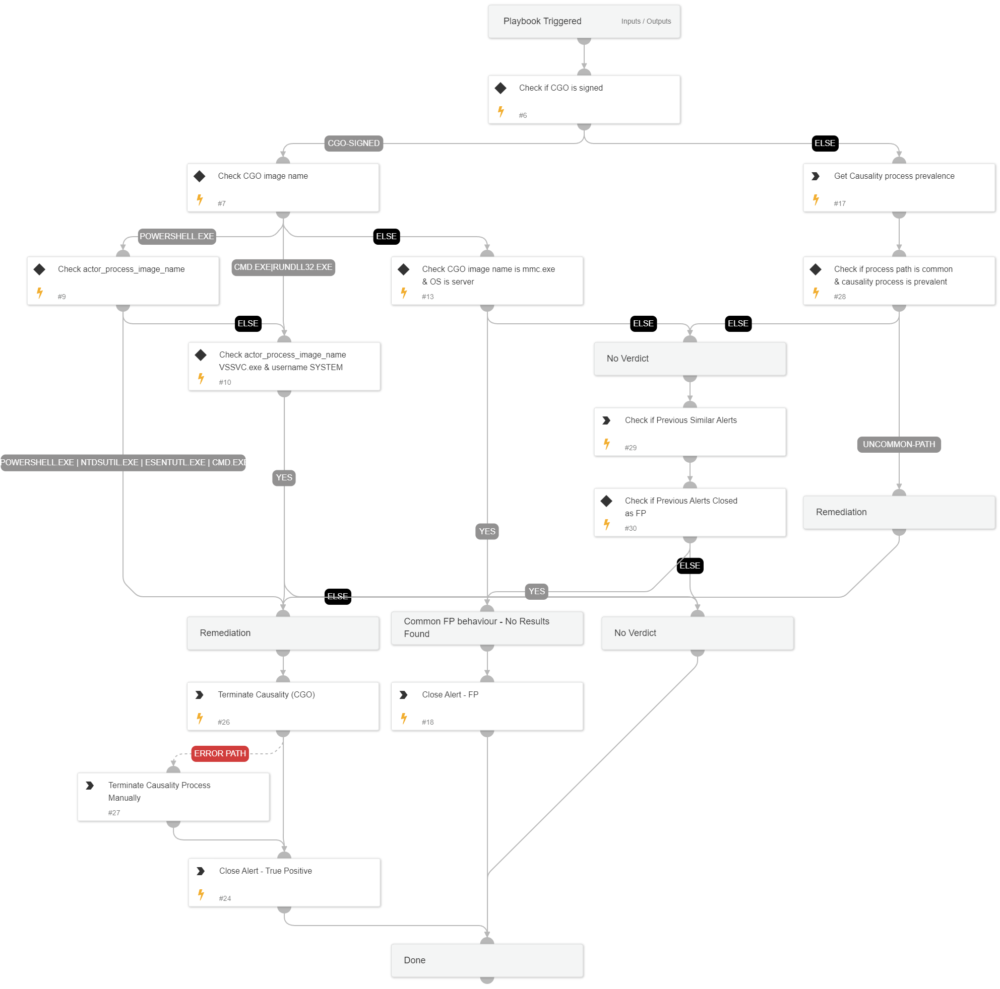

This playbook addresses the following alerts:
 
- Uncommon creation or access operation of sensitive shadow copy by a high-risk process
- Suspicious access to shadow file
 
Playbook Stages:
  
Triage: 
 
- Check if the causality process image (CGO) is signed or not
 
Investigation:
 
- Examine process details, prevalence, and historical data for similar alerts
- If CGO is unsigned:
  - Check the CGO process prevalence
  - Check if the process image path is common
- If CGO is signed:
  - Check process image name
  - Check intiating process image name
  - Check if username is SYSTEM
  - Check if host is a server
  - Check for previous similar alerts
 
Containment:
 
- Terminate causality process (CGO) process

## Dependencies

This playbook uses the following sub-playbooks, integrations, and scripts.

### Sub-playbooks

This playbook does not use any sub-playbooks.

### Integrations

* CortexCoreIR

### Scripts

* SearchIncidentsV2

### Commands

* closeInvestigation
* core-get-process-analytics-prevalence
* core-terminate-causality

## Playbook Inputs

---
There are no inputs for this playbook.

## Playbook Outputs

---
There are no outputs for this playbook.

## Playbook Image

---

