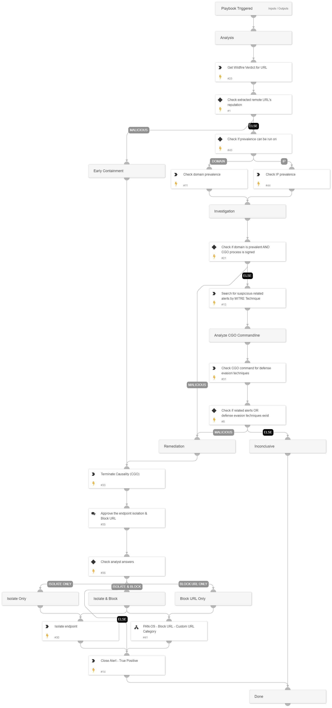

This playbook addresses the following alerts:
 
- Msiexec execution of an executable from an uncommon remote location with a specific port
- Msiexec execution of an executable from an uncommon remote location without properties
 
Playbook Stages:
  
Analysis: 
 
- Check extracted domain's reputation
- Check extracted domain's prevalence
 
 
Investigation:
 
- Check for suspicious related alerts: 
    - Local Analysis Malware
    - Mitre Techniques:
        - T1140 - Deobfuscate/Decode Files or Information
        - T1059 - Command and Scripting Interpreter 

Containment:
 
- Kill causality process
- Block maliciou URL
 
Requirements: 
 
For any response action, you need one of the following integrations:
 
- PAN-OS.

## Dependencies

This playbook uses the following sub-playbooks, integrations, and scripts.

### Sub-playbooks

* PAN-OS - Block URL - Custom URL Category

### Integrations

* CortexCoreIR

### Scripts

* CommandLineAnalysis
* SearchIncidentsV2

### Commands

* closeInvestigation
* core-get-IP-analytics-prevalence
* core-get-domain-analytics-prevalence
* core-isolate-endpoint
* core-terminate-causality
* wildfire-get-verdict

## Playbook Inputs

---
There are no inputs for this playbook.

## Playbook Outputs

---
There are no outputs for this playbook.

## Playbook Image

---

