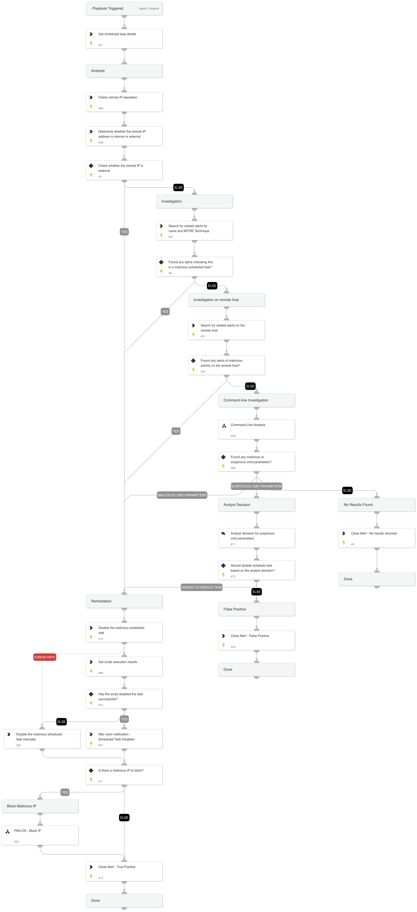

This playbook is designed to handle the alert "Uncommon remote scheduled task created".

Playbook Stages:

Analysis:

- The playbook checks if the remote IP is external or has a bad reputation.

Investigation:
During the alert investigation, the playbook will perform the following:

- Searches for related XDR alerts to the endpoint using the following MITRE techniques to identify any malicious activity: T1202 - Indirect Command Execution, T1021 - Remote Services.
- Searches for related XSIAM agent alerts on the remote endpoint to determine if the creation of the scheduled task is part of an attack pattern.
- Searches for suspicious command-line parameters indicating a malicious scheduled task.

Remediation:

- Remediation actions will disable the scheduled task and block the malicious IP, and close the alert.

Requirements:

For response actions, the following integrations are required: 

- PAN-OS.

## Dependencies

This playbook uses the following sub-playbooks, integrations, and scripts.

### Sub-playbooks

* Command-Line Analysis
* PAN-OS - Block IP

### Integrations

* CoreIOCs
* CortexCoreIR
* CortexCoreXQLQueryEngine

### Scripts

* IsIPInRanges
* Print
* SearchIncidentsV2

### Commands

* closeInvestigation
* core-get-cloud-original-alerts
* core-run-script-execute-commands
* ip

## Playbook Inputs

---
There are no inputs for this playbook.

## Playbook Outputs

---
There are no outputs for this playbook.

## Playbook Image

---

