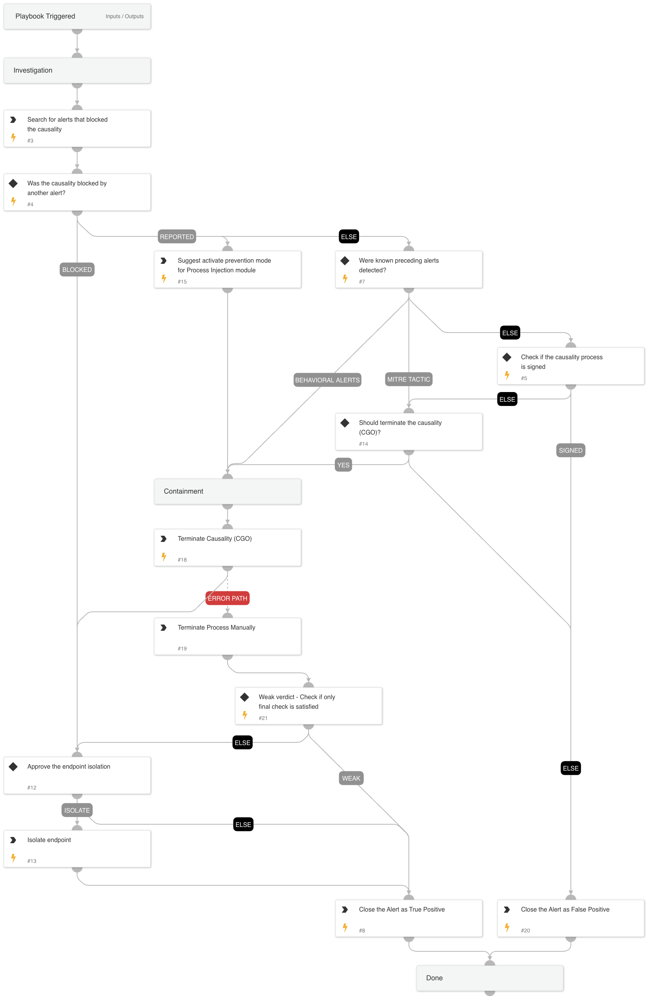

Overview

This playbook is designed to handle process injection alerts by analyzing preceding events, checking for agent prevention rules, and determining remediation actions. The playbook follows a logical flow to assess the risk, suggest improvements, and remediate potential threats.

### This playbook handles the following alerts:
 
- Unsigned and unpopular process performed injection into a commonly abused process

- Unsigned and unpopular process performed process hollowing injection

- Unsigned and unpopular process performed queue APC injection

- Unsigned and unpopular process performed injection into a sensitive process

- Unsigned and unpopular process performed injection into svchost.exe

### Logical Flow

#### 1. Retrieve Alerts from Case
- Retrieve all alerts associated with the case.

#### 2. Check for Agent Prevention Rule
- Check if an agent prevention rule was triggered during the alert.
  
  ##### 2a. Block Mode
  - If the agent rule was triggered and set to **block mode**, proceed directly to endpoint isolation.

  ##### 2b. Report Mode
  - If the agent rule was triggered and set to **report mode**, display a message suggesting the customer change the rule to **prevent mode** for future alerts.

  ##### 2c. No Agent Rule Triggered
  - If no agent prevention rule was triggered, continue to the following checks.

#### 3. Check for Commonly Triggered Alerts Before Injection
- Check if any commonly triggered alerts that typically precede process injection (as seen in previous cases) are present.

  ##### 3a. Common Alerts Found
  - If such alerts are found, initiate remediation actions.

  ##### 3b. No Common Alerts Found
  - If no such alerts are found, continue to the next step.

#### 4. Analyze for MITRE Tactics TA0004 (Privilege Escalation) and TA0005 (Defense Evasion)
- Check if there are any alerts or events that match the MITRE ATT&CK tactics for **Privilege Escalation (TA0004)** and **Defense Evasion (TA0005)**.

  ##### 4a. Alerts Matching MITRE Tactics Found
  - If alerts related to these tactics are found, initiate remediation actions.

  ##### 4b. No MITRE Tactics Found
  - If no relevant tactics are found, continue to the next step.

#### 5. Check if Causality Process is Signed
- Investigate if the causality (parent) process is signed with a legitimate certificate.

  ##### 5a. Process is Signed
  - If the process is signed by a trusted authority, close the alert.

  ##### 5b. Process is Not Signed
  - If the process is not signed, escalate for manual approval to proceed with remediation actions.

## Remediation Actions
When remediation is triggered:

- **Terminate Malicious Processes**: Terminate the CGO.
- **Endpoint Isolation**: Isolate the endpoint in specific high-risk cases to prevent further compromise.

## Dependencies

This playbook uses the following sub-playbooks, integrations, and scripts.

### Sub-playbooks

This playbook does not use any sub-playbooks.

### Integrations

* CortexCoreIR

### Scripts

* Print
* SearchIncidentsV2

### Commands

* closeInvestigation
* core-isolate-endpoint
* core-terminate-causality

## Playbook Inputs

---
There are no inputs for this playbook.

## Playbook Outputs

---
There are no outputs for this playbook.

## Playbook Image

---

