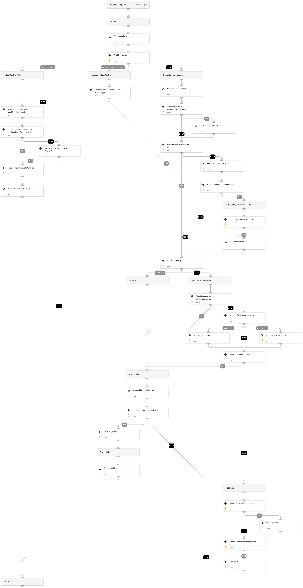

This playbook handles WildFire Malware alerts.
It performs enrichment on the different alert entities and establishes a verdict.
For a possible true positive alert, the playbook performs further investigation for related IOCs and executes a containment plan.

## Dependencies

This playbook uses the following sub-playbooks, integrations, and scripts.

### Sub-playbooks

* Enrichment for Verdict
* Endpoint Investigation Plan
* Recovery Plan
* Containment Plan
* Handle False Positive Alerts

### Integrations

* CortexCoreIR

### Scripts

* GetTime

### Commands

* core-report-incorrect-wildfire
* closeInvestigation
* core-blocklist-files
* core-allowlist-files

## Playbook Inputs

---

| **Name** | **Description** | **Default Value** | **Required** |
| --- | --- | --- | --- |
| sha256 | The SHA256 hash of the suspected file. Decided by the DT expression wether it's the initiator or the target file SHA256. | alert | Optional |
| GraywarePhishingAsMalware | Whether to treat grayware and phishing alerts as malware. | true | Optional |
| AutoContainment | Whether to execute the containment plan \(except isolation\) automatically. The specific containment playbook inputs should also be set to 'True'. | true | Optional |
| HostAutoContainment | Whether to automatically execute endpoint isolation in case there are investigation findings. | true | Optional |
| BlockIndicators | Set to True if you want to block the indicators. | false | Optional |
| OriginalFileContainment | Set to True if you want to quarantine the original malicious file. | true | Optional |
| RelatedFileContainment | Set to True to quarantine the identified files found in the investigation. | true | Optional |
| FileRemediation | Choose 'Quarantine' or 'Delete'  to avoid file remediation conflicts.  For example, choosing 'Quarantine' ignores the 'Delete file' task under the eradication playbook and executes only file quarantine. | Quarantine | Optional |
| AutoMarkFP | Whether to automatically mark alerts that were found as benign by the 'Enrichment for Verdict' playbook and report false positive alerts to WildFire. True/False. |  | Optional |
| EmailAddress | User's email address to use when reporting false positive alerts to WildFire. |  | Optional |
| ShouldCloseAutomatically | Whether to automatically close the alert after investigation and remediation are finished. True/False. |  | Optional |
| AutoRecovery | Whether to execute the Recovery playbook after the investigation and remediation are finished. True/False. |  | Optional |
| Query | The query for searching previous alerts based on the file we want to respond to. Decided by the If-Then-Else expression wether it's the initiator or the target file. | alert | Optional |

## Playbook Outputs

---
There are no outputs for this playbook.

## Playbook Image

---

