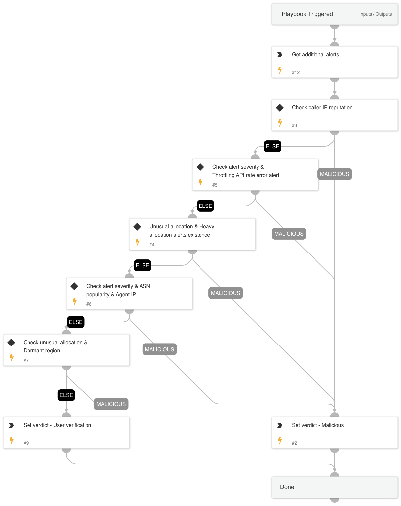

This playbook sets the alert's verdict as malicious if one of the following conditions is true:
1. If the source IP address is malicious
2. If the incident includes both "Unusual allocation of multiple cloud compute resources" AND "Cloud identity reached a throttling API rate" (medium/high severity)
3. If the incident includes both "Unusual allocation of multiple cloud compute resources" AND "Suspicious heavy allocation of compute resources - possible mining activity" 
4. If the incident includes "Unusual allocation of multiple cloud compute resources" with medium/high severity, the source ASN isn't known, and the source IP isn't known as well.
5. If the incident includes both "Unusual allocation of multiple cloud compute resources" AND "A cloud compute instance was created in a dormant region"

If none of the conditions is true, the playbook will wait for an analyst's decision.

## Dependencies
This playbook uses the following sub-playbooks, integrations, and scripts.

### Sub-playbooks
This playbook does not use any sub-playbooks.

### Integrations
This playbook does not use any integrations.

### Scripts
* Set
* SearchIncidentsV2

### Commands
This playbook does not use any commands.

## Playbook Inputs
---

| **Name** | **Description** | **Default Value** | **Required** |
| --- | --- | --- | --- |
| sourceIP | The source IP of the attack. |  | Optional |

## Playbook Outputs
---

| **Path** | **Description** | **Type** |
| --- | --- | --- |
| alertVerdict | The alert verdict | string |

## Playbook Image
---
