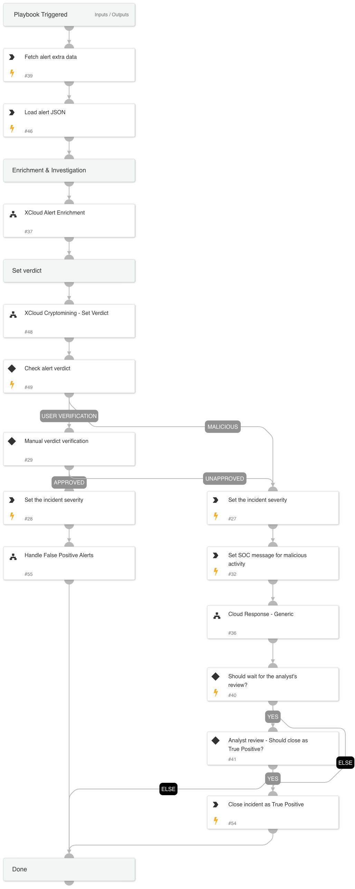

Investigates a Cortex XDR incident containing Cloud Cryptomining related alert. 
The playbook supports AWS, Azure, and GCP and executes the following:

- Cloud enrichment:

    -Collects info about the involved resources

    -Collects info about the involved identities

    -Collects info about the involved IPs

- Verdict decision tree

- Verdict handling:

 -Handle False Positives

 -Handle True Positives

 -Cloud Response - Generic sub-playbook.

- Notifies the SOC if a malicious verdict was found

## Dependencies
This playbook uses the following sub-playbooks, integrations, and scripts.

### Sub-playbooks
* Cloud Response - Generic
* XCloud Cryptomining - Set Verdict
* Handle False Positive Alerts
* XCloud Alert Enrichment

### Integrations
* CortexCoreIR

### Scripts
* LoadJSON
* IncreaseIncidentSeverity

### Commands
* core-get-cloud-original-alerts
* closeInvestigation
* send-mail

## Playbook Inputs
---

| **Name** | **Description** | **Default Value** | **Required** |
| --- | --- | --- | --- |
| alert_id | The alert ID. |  | Optional |
| SOCEmailAddress | The SOC email address to use for the alert status notification. | None | Optional |
| requireAnalystReview | Whether to require an analyst review after the alert remediation. | True | Optional |
| ShouldCloseAutomatically | Should we automatically close false positive alerts? Specify true/false. | False | Optional |
| ShouldHandleFPautomatically | Should we automatically handle false positive alerts? Specify true/false. | False | Optional |
| autoAccessKeyRemediation | Whether to execute the user remediation flow automatically. | False | Optional |
| autoBlockIndicators | Whether to block the indicators automatically. | False | Optional |
| autoResourceRemediation | Whether to execute the resource remediation flow automatically. | False | Optional |
| autoUserRemediation | Whether to execute the user remediation flow automatically. | False | Optional |
| AWS-accessKeyRemediationType | Choose the remediation type for the user's access key.  AWS available types: Disable - for disabling the user's access key. Delete - for the user's access key deletion. | Disable | Optional |
| AWS-resourceRemediationType | Choose the remediation type for the instances created.  AWS available types: Stop - for stopping the instances. Terminate - for terminating the instances. | Stop | Optional |
| AWS-userRemediationType | Choose the remediation type for the user involved.  AWS available types: Delete - for the user deletion. Revoke - for revoking the user's credentials. | Revoke | Optional |
| Azure-resourceRemediationType | Choose the remediation type for the instances created.  Azure available types: Poweroff - for shutting down the instances. Delete - for deleting the instances. | Poweroff | Optional |
| Azure-userRemediationType | Choose the remediation type for the user involved.  Azure available types: Disable - for disabling the user. Delete - for deleting the user. | Disable | Optional |
| cloudProvider | The cloud service provider involved. | alert.cloudprovider | Optional |
| GCP-accessKeyRemediationType | Choose the remediation type for the user's access key.  GCP available types: Disable - For disabling the user's access key. Delete - For the deleting user's access key. | Disable | Optional |
| GCP-resourceRemediationType | Choose the remediation type for the instances created.  GCP available types: Stop - For stopping the instances. Delete - For deleting the instances. | Stop | Optional |
| GCP-userRemediationType | Choose the remediation type for the user involved.  GCP available types: Delete - For deleting the user. Disable - For disabling the user. | Disable | Optional |
| ResolveIP | Determines whether to convert the IP address to a hostname using a DNS query \(True/ False\). | True | Optional |
| InternalRange | A list of internal IP ranges to check IP addresses against.  For IP Enrichment - Generic v2 playbook. |  | Optional |

## Playbook Outputs
---
There are no outputs for this playbook.

## Playbook Image
---
