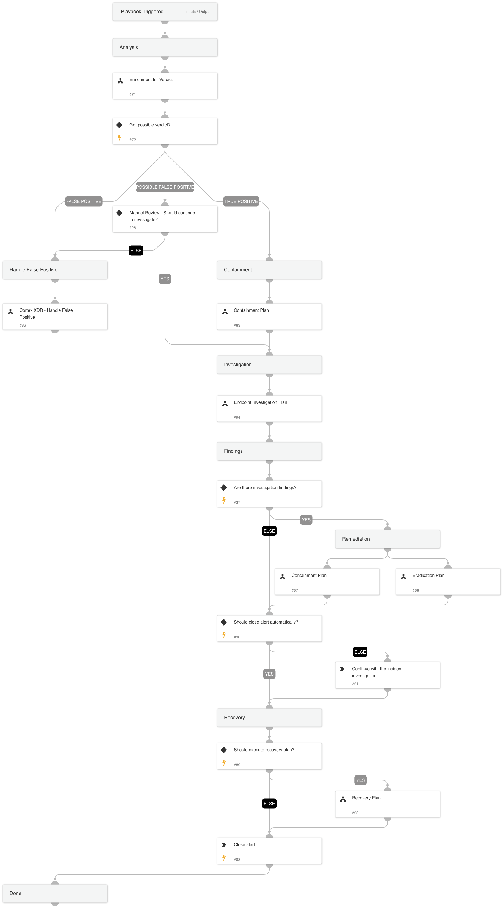

[Cortex XSIAM](https://www.paloaltonetworks.com/cortex/cortex-xsiam) is an intelligent data foundation, where high-quality telemetry across the security infrastructure, threat intelligence, external attack surface data and user response actions are ingested and integrated automatically. Unlike SIEM, Cortex XSIAM ingests granular data – not just alerts and logs – to fuel many layers of machine learning that automate critical threat detection and remediation steps downstream.

## What does this pack do?
The playbooks included in this pack help you respond to Cortex XSIAM alerts in a timely manner. They also help automate repetitive tasks associated with Cortex XSIAM alerts:

- Syncs and updates Cortex XSIAM alerts.
- Triggers a sub-playbook to handle each alert by type.
- Extracts and enriches all relevant indicators from the source alert.
- Hunts for related IOCs.
- Calculates the severity of the alert.
- Interacts with the analyst to choose a remediation path or close the incident as a false positive based on the gathered information and incident severity.
- Remediates the incident by blocking malicious indicators and isolating infected endpoints.
- Run XQL Queries as part of an automation, or in a playbook (consumes compute units).

