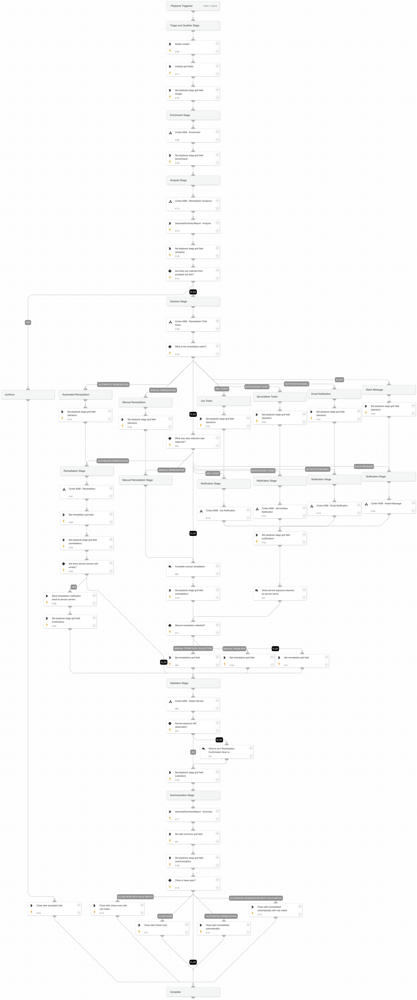

This playbook handles ASM alerts by enriching asset information and providing a means of remediating the issue directly or through contacting service owners.

## Dependencies

This playbook uses the following sub-playbooks, integrations, and scripts.

### Sub-playbooks

* Cortex ASM - Remediation
* Cortex ASM - Remediation Guidance
* Cortex ASM - Remediation Path Rules
* Cortex ASM - Detect Service
* Cortex ASM - Enrichment

### Integrations

* ServiceNow v2

### Scripts

* GenerateASMReport
* GetTime
* GridFieldSetup

### Commands

* send-mail
* servicenow-create-ticket
* closeInvestigation

## Playbook Inputs

---

| **Name** | **Description** | **Default Value** | **Required** |
| --- | --- | --- | --- |
| OwnerNotificationSubject | Subject of the notification \(email or ticket\) sent to potential service owner. | A new security risk was identified on an external service owned by your team | Required |
| OwnerNotificationBody | Body of the notification \(email or ticket\) sent to a potential service owner. | Infosec identified a security risk on an external service potentially owned by your team: ${alert.name}  Description: ${alert.details}   | Required |
| RemediationRule | The firewall rule that will be used for remediating internet exposures.  | Remediation-Security-Group | Required |

## Playbook Outputs

---
There are no outputs for this playbook.

## Playbook Image

---

