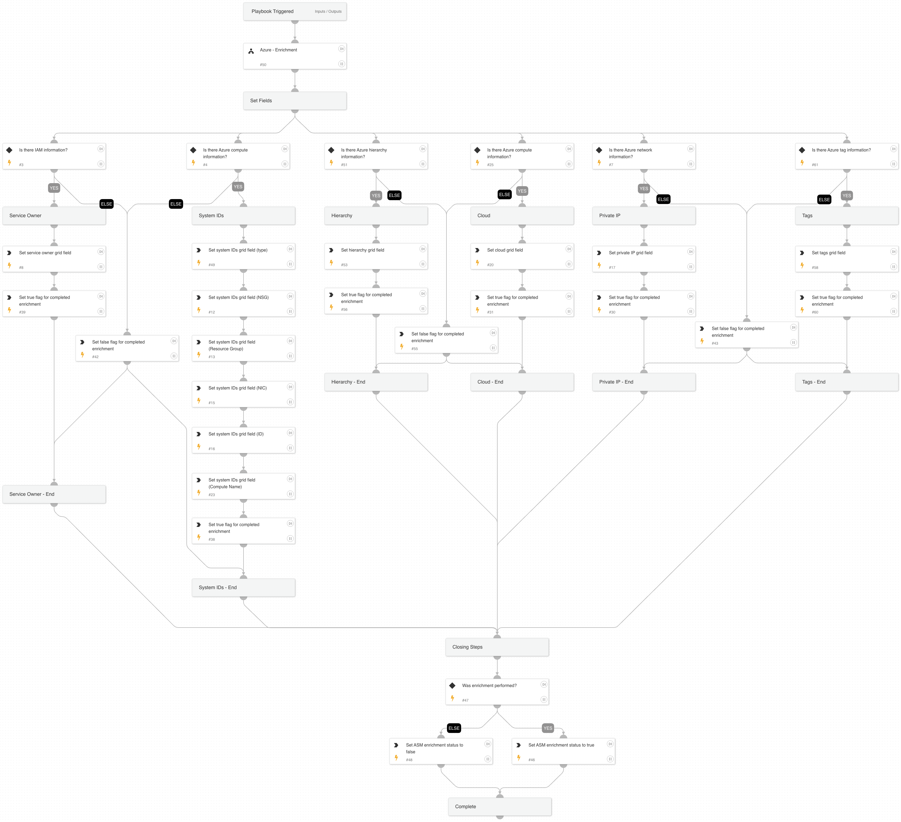

Given the IP address, this playbook enriches Azure information relevant to ASM alerts.

## Dependencies

This playbook uses the following sub-playbooks, integrations, and scripts.

### Sub-playbooks

Azure - Enrichment

### Integrations

This playbook does not use any integrations.

### Scripts

* GetTime
* GridFieldSetup

### Commands

This playbook does not use any commands.

## Playbook Inputs
---

| **Name** | **Description** | **Default Value** | **Required** |
| --- | --- | --- | --- |
| RemoteIP | IP address of service. | alert.remoteip | Optional |

## Playbook Outputs

---
There are no outputs for this playbook.

## Playbook Image

---
