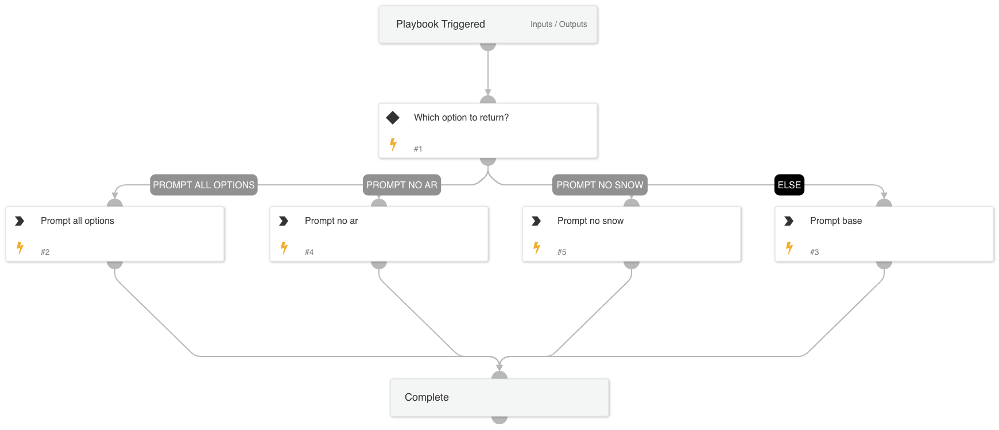

This playbook returns "RemediationAction" options based on meeting "Automated Remediation Requirements" (https://github.com/demisto/content/tree/master/Packs/CortexAttackSurfaceManagement#automated-remediation-requirements) as well as whether ServiceNowV2 integration is set up.  Possible return values are:
- Prompt base - data collection task with only email/manual options.
- Prompt all options - data collection task with all options (meets Automated Remediation requirements and ServiceNow is enabled).
- Prompt no snow - all options except ServiceNow (Automated Remediation requirements are met).
- Prompt no ar - all options except Automated Remediation (ServiceNow is enabled).

## Dependencies
This playbook uses the following sub-playbooks, integrations, and scripts.

### Sub-playbooks
This playbook does not use any sub-playbooks.

### Integrations
This playbook does not use any integrations.

### Scripts
Set

### Commands
This playbook does not use any commands.

## Playbook Inputs
---

| **Name** | **Description** | **Default Value** | **Required** |
| --- | --- | --- | --- |
| ServiceNowv2Enabled | ServiceNow v2 integration enabled. |  | Required |
| AutoRemediationRequirements | Meets automated remediation requirements \(https://github.com/demisto/content/tree/master/Packs/CortexAttackSurfaceManagement\#automated-remediation-requirements\). |  | Required |

## Playbook Outputs
---

| **Path** | **Description** | **Type** |
| --- | --- | --- |
| RemediationAction | Follow up action to perform \(variety of data collection tasks\). | string |

## Playbook Image
---
