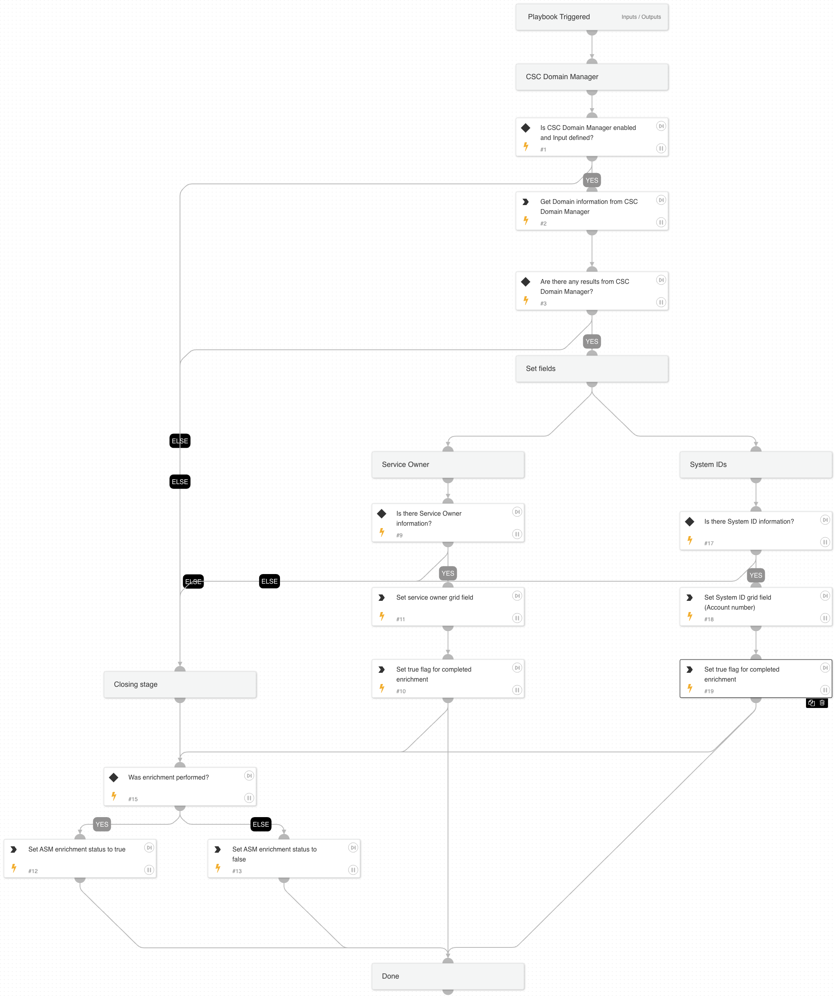

Playbook to enrich domain information.

## Dependencies

This playbook uses the following sub-playbooks, integrations, and scripts.

### Sub-playbooks

This playbook does not use any sub-playbooks.

### Integrations

CSCDomainManager

### Scripts

* Set
* GridFieldSetup

### Commands

domain

## Playbook Inputs

---

| **Name** | **Description** | **Default Value** | **Required** |
| --- | --- | --- | --- |
| Hostname | Input for domain enrichment. | ${alert.hostname} | Optional |

## Playbook Outputs

---
There are no outputs for this playbook.

## Playbook Image

---

