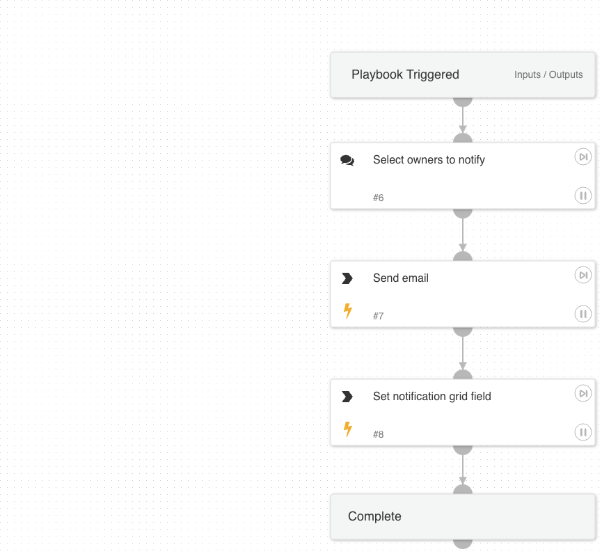

This playbook is used to send email notifications to service owners to notify them of their internet exposures.

## Dependencies

This playbook uses the following sub-playbooks, integrations, and scripts.

### Sub-playbooks

Cortex ASM - Remediation Guidance

### Integrations

This playbook does not use any integrations.

### Scripts

GridFieldSetup

### Commands

send-mail

## Playbook Inputs

---

| **Name** | **Description** | **Default Value** | **Required** |
| --- | --- | --- | --- |
| OwnerNotificationSubject | Subject of the notification \(email or ticket\) sent to the potential service owner. |  | Required |
| OwnerNotificationBody | Body of the notification \(email or ticket\) sent to the potential service owner. |  | Optional |

## Playbook Outputs

---
There are no outputs for this playbook.

## Playbook Image

---

