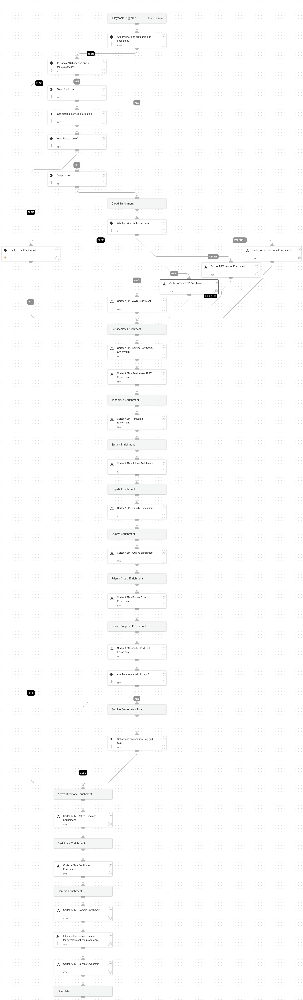

## Playbook to enrich ASM alerts

Used as a container folder for all enrichments of ASM alerts.

## Dependencies
This playbook uses the following sub-playbooks, integrations, and scripts.

### Sub-playbooks
* ServiceNow CMDB Search
* AWS - Enrichment

### Integrations
* Cortex Attack Surface Management
* ServiceNow v2

### Scripts
* GridFieldSetup
* GetTime

### Commands
* servicenow-query-users
* asm-list-external-service

## Playbook Inputs
---

| **Name** | **Description** | **Default Value** | **Required** |
| --- | --- | --- | --- |
| RemoteIP | IP address of service | alert.remoteip | Required |

## Playbook Outputs
---
There are no outputs for this playbook.

## Playbook Image
---
