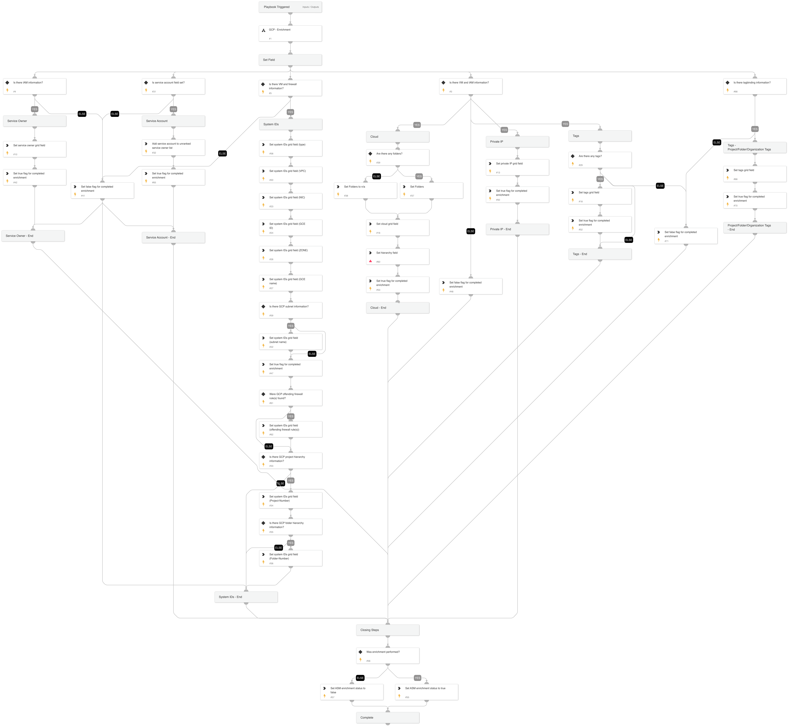

Given the IP address this playbook enriches GCP and Firewall information.

## Dependencies

This playbook uses the following sub-playbooks, integrations, and scripts.

### Sub-playbooks

* GCP - Enrichment

### Integrations

This playbook does not use any integrations.

### Scripts

* Set
GridFieldSetup

### Commands

setAlert

## Playbook Inputs

---

| **Name** | **Description** | **Default Value** | **Required** |
| --- | --- | --- | --- |
| RemoteIP | IP address of service | alert.remoteip | Optional |

## Playbook Outputs

---
There are no outputs for this playbook.

## Playbook Image

---

