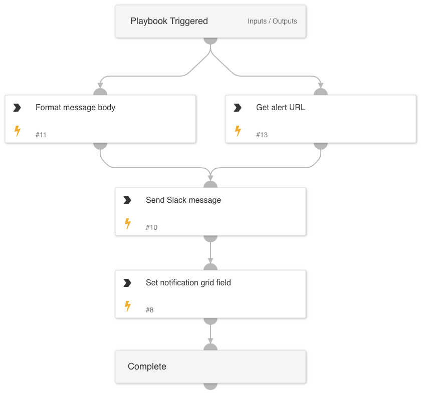

This playbook is used to create instant messages toward service owners to notify them of their internet exposures.

## Dependencies

This playbook uses the following sub-playbooks, integrations, and scripts.

### Sub-playbooks

This playbook does not use any sub-playbooks.

### Integrations

SlackV3

### Scripts

* Set
* GridFieldSetup

### Commands

send-notification

## Playbook Inputs

---

| **Name** | **Description** | **Default Value** | **Required** |
| --- | --- | --- | --- |
| OwnerNotificationBody | Body of the notification \(email or ticket\) sent to the potential service owner. |  | Required |
| InstantMessageChannel | Channel to send instant messages for notification purposes.  For Slack, this will be the channel ID. |  | Required |
| RemediationGuidance | Remediation Guidance of the Attack Surface Rule. |  | Required |

## Playbook Outputs

---
There are no outputs for this playbook.

## Playbook Image

---

