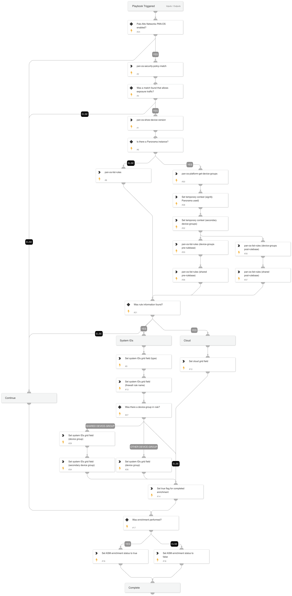

Given an IP address, port, and protocol of a service, this playbook enriches on-prem integrations to find the related firewall rule and other related information.

Conditions:
- Multiple integration instances configured at the same time are not supported (Panorama or standalone NGFW).
- !pan-os-security-policy-match fails if any firewall is disconnected (Panorama).
- Matching on different rules for different firewalls not supported (Panorama).

## Dependencies

This playbook uses the following sub-playbooks, integrations, and scripts.

### Sub-playbooks

This playbook does not use any sub-playbooks.

### Integrations

* Panorama

### Scripts

* GridFieldSetup
* Set

### Commands

* pan-os-security-policy-match
* pan-os-platform-get-device-groups
* pan-os-list-rules
* pan-os-show-device-version

## Playbook Inputs

---

| **Name** | **Description** | **Default Value** | **Required** |
| --- | --- | --- | --- |
| RemoteIP | IP address of the service. | alert.remoteip | Required |
| RemotePort | Port number of the service. | alert.remoteport | Required |
| RemoteProtocol | Protocol of the service. | alert.appid | Required |

## Playbook Outputs

---
There are no outputs for this playbook.

## Playbook Image

---

