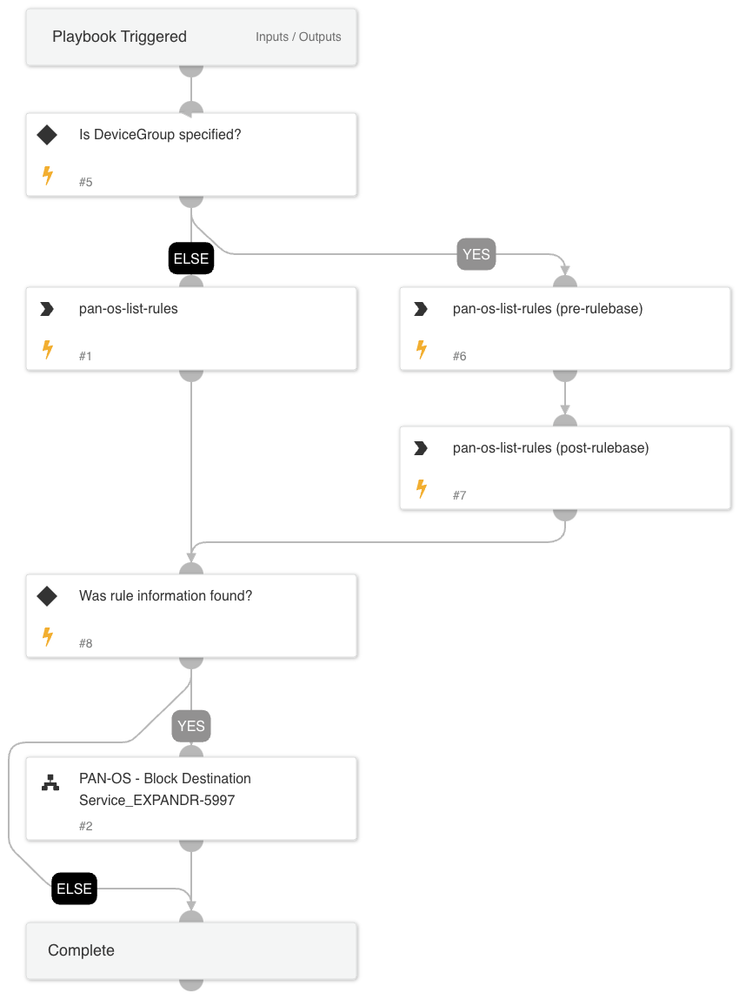

This playbook adds new block rule(s) to on-prem firewall vendors in order to block internet access for internet exposures.

Conditions:
- Multiple integration instances configured at the same time are not supported (Panorama or standalone NGFW).
- Multiple rules with the same name in different device-groups not supported (Panorama).
- !pan-os-list-services will fail if there are no services in a specific device-group (Panorama).

## Dependencies

This playbook uses the following sub-playbooks, integrations, and scripts.

### Sub-playbooks

* PAN-OS - Block Destination Service

### Integrations

* Panorama

### Scripts

This playbook does not use any scripts.

### Commands

* pan-os-list-rules

## Playbook Inputs

---

| **Name** | **Description** | **Default Value** | **Required** |
| --- | --- | --- | --- |
| RuleName | Firewall rule name to look up in the company configuration setting for block rule. |  | Required |
| RemoteIP | IP address of the service. | alert.remoteip | Required |
| RemoteProtocol | Protocol of the service. | alert.appid | Required |
| RemotePort | Port number of the service. | alert.remoteport | Required |
| DeviceGroup | Device group of the firewall rule to lookup. |  | Optional |
| SecondaryDeviceGroup | If the rule, address and service are created in the "Shared" location, we need to know what device-groups we can push to because it isn't possible to push to the "Shared" location. |  | Optional |

## Playbook Outputs

---
There are no outputs for this playbook.

## Playbook Image

---

