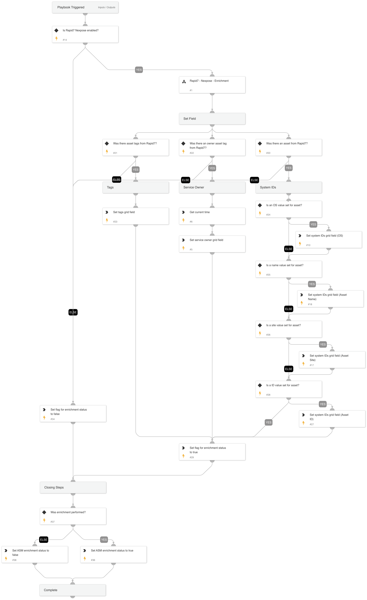

Given the IP address this playbook enriches Rapid7 InsightVM (Nexpose) information relevant to ASM alerts.

## Dependencies

This playbook uses the following sub-playbooks, integrations, and scripts.

### Sub-playbooks

* Rapid7 - Nexpose - Enrichment

### Integrations

This playbook does not use any integrations.

### Scripts

* GetTime
* GridFieldSetup

### Commands

This playbook does not use any commands.

## Playbook Inputs

---
There are no inputs for this playbook.

## Playbook Outputs

---
There are no outputs for this playbook.

## Playbook Image

---

