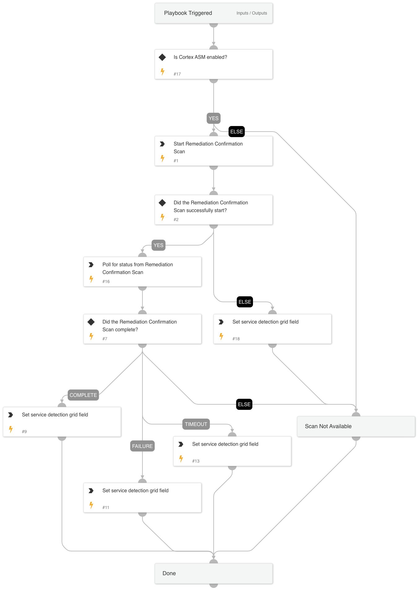

This playbook handles ASM Remediation Confirmation Scan by first creating a scan for an existing service ID, if the scan does not already exist. It then polls for results of a successful or failed scan.

## Dependencies

This playbook uses the following sub-playbooks, integrations, and scripts.

### Sub-playbooks

GenericPolling

### Integrations

CortexAttackSurfaceManagement

### Scripts

* GridFieldSetup
* GetTime

### Commands

* asm-get-remediation-confirmation-scan-status
* asm-start-remediation_confirmation_scan

## Playbook Inputs

---
There are no inputs for this playbook.

## Playbook Outputs

---
There are no outputs for this playbook.

## Playbook Image

---

