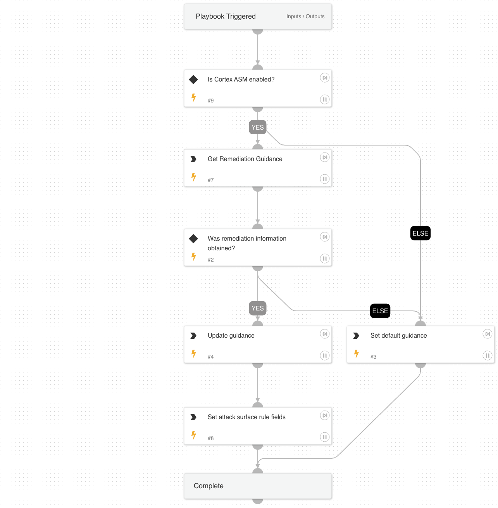

This playbook pulls remediation guidance off of a list based on ASM RuleID to be used in service owner notifications (email or ticketing system).

## Dependencies

This playbook uses the following sub-playbooks, integrations, and scripts.

### Sub-playbooks

This playbook does not use any sub-playbooks.

### Integrations

Cortex Attack Surface Management

### Scripts

Set

### Commands

* asm-get-attack-surface-rule
* setAlert

## Playbook Inputs

---

| **Name** | **Description** | **Default Value** | **Required** |
| --- | --- | --- | --- |
| IssueTypeID | Attack surface management issue rule ID. | alert.asmattacksurfaceruleid | Required |

## Playbook Outputs

---

| **Path** | **Description** | **Type** |
| --- | --- | --- |
| RemediationGuidance | Remediation guidance to be sent to the service owner via notification \(email or ticketing system\). | unknown |

## Playbook Image

---

