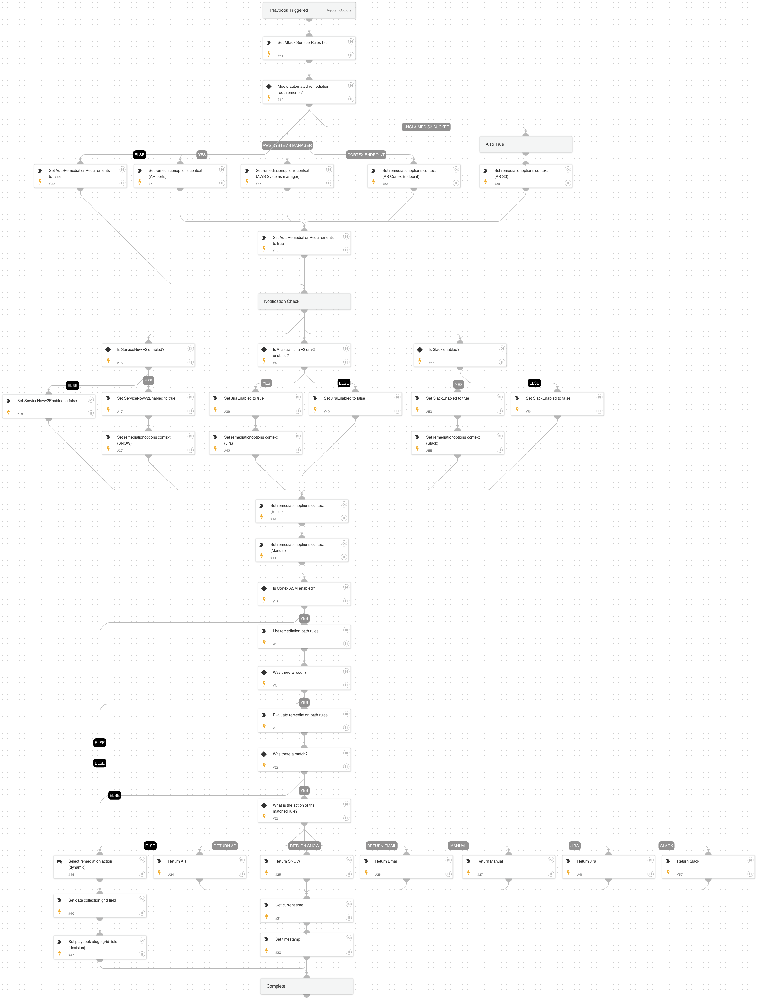

This playbook returns "RemediationAction" options based on the return from the Remediation Path Rules API, or defaults to data collection task options from the "Cortex ADM - Decision" sub-playbook.

## Dependencies

This playbook uses the following sub-playbooks, integrations, and scripts.

### Sub-playbooks

* Cortex ASM - Decision

### Integrations

* CortexAttackSurfaceManagement

### Scripts

* Set
* GetTime
* RemediationPathRuleEvaluation

### Commands

* asm-list-remediation-rule

## Playbook Inputs

---

| **Name** | **Description** | **Default Value** | **Required** |
| --- | --- | --- | --- |
| ExternallyDetectedProviders | Providers of the external service. |  | Optional |

## Playbook Outputs

---

| **Path** | **Description** | **Type** |
| --- | --- | --- |
| RemediationAction | Remediation action to be taken. | string |
| RPR_Timestamp | Timestamp of when the remediation path rule action was determined. | string |

## Playbook Image

---

