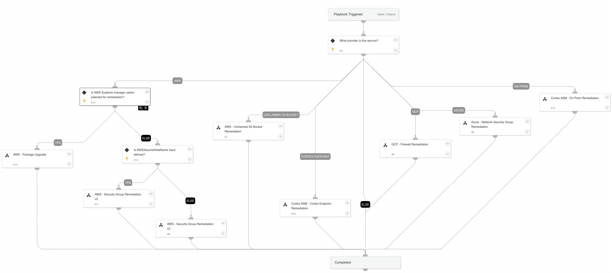

This playbook contains all the cloud provider sub playbooks for remediation

## Dependencies

This playbook uses the following sub-playbooks, integrations, and scripts.

### Sub-playbooks

* AWS - Unclaimed S3 Bucket Remediation
* GCP - Firewall Remediation
* AWS - Security Group Remediation v2
* Azure - Network Security Group Remediation

### Integrations

This playbook does not use any integrations.

### Scripts

This playbook does not use any scripts.

### Commands

This playbook does not use any commands.

## Playbook Inputs

---
There are no inputs for this playbook.

## Playbook Outputs

---
There are no outputs for this playbook.

## Playbook Image

---

