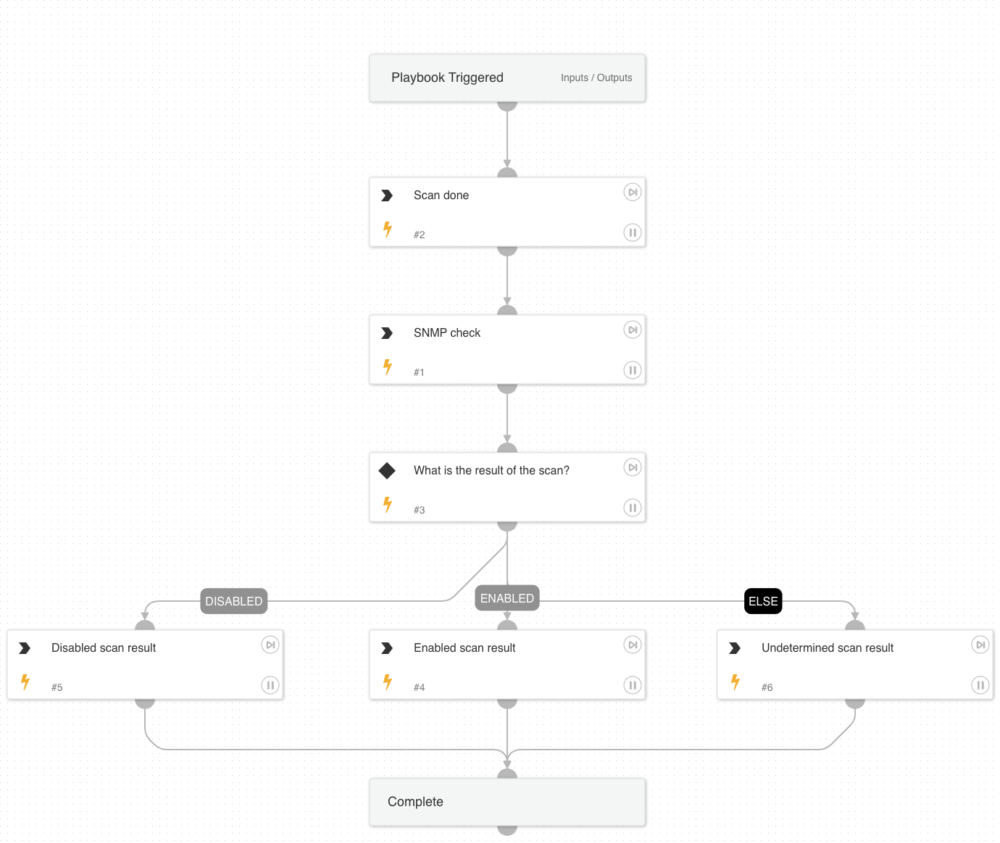

Sub-playbook that performs an SNMP scan and checks if SNMP is enabled or not and obtains running versions.

## Dependencies
This playbook uses the following sub-playbooks, integrations, and scripts.

### Sub-playbooks
This playbook does not use any sub-playbooks.

### Integrations
This playbook does not use any integrations.

### Scripts
* SnmpDetection
* Set

### Commands
This playbook does not use any commands.

## Playbook Inputs
---

| **Name** | **Description** | **Default Value** | **Required** |
| --- | --- | --- | --- |
| RemoteIP | Remote IP address in an incident/alert. |  | Required |

## Playbook Outputs
---

| **Path** | **Description** | **Type** |
| --- | --- | --- |
| ScanResult | The result of the scan \(if done\). | unknown |
| ScanDone | Whether a scan was actually performed \(based on sub-types\). | unknown |
| SnmpDetection | This returns if SNMP port is responsive. | unknown |

## Playbook Image
---

