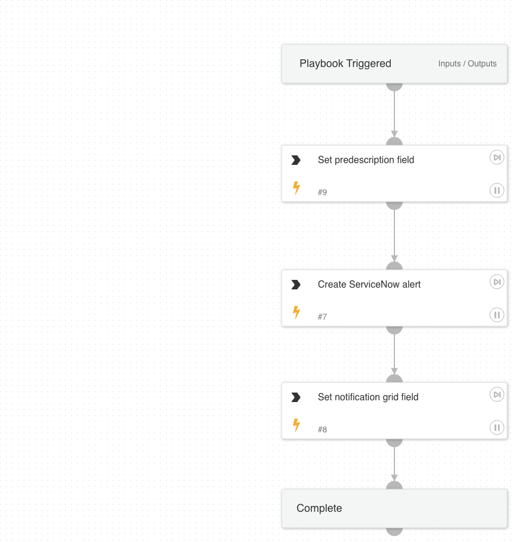

This playbook is used to create ServiceNow tickets directed toward service owners to notify them of their internet exposures.

## Dependencies

This playbook uses the following sub-playbooks, integrations, and scripts.

### Integrations

ServiceNow v2

### Scripts

GridFieldSetup

### Commands

servicenow-create-ticket

## Playbook Inputs

---

| **Name** | **Description** | **Default Value** | **Required** |
| --- | --- | --- | --- |
| OwnerNotificationBody | Body of the notification \(email or ticket\) sent to the potential service owner. |  | Required |
| NotificationTicketType | The ticket type used by ticketing systems. The default is "incident" because ticketing systems such as ServiceNow and Cherwell use it as default. |  | Required |
| RemediationGuidance | Remediation Guidance of the Attack Surface Rule. |  | Required |

## Playbook Outputs

---
There are no outputs for this playbook.

## Playbook Image

---

