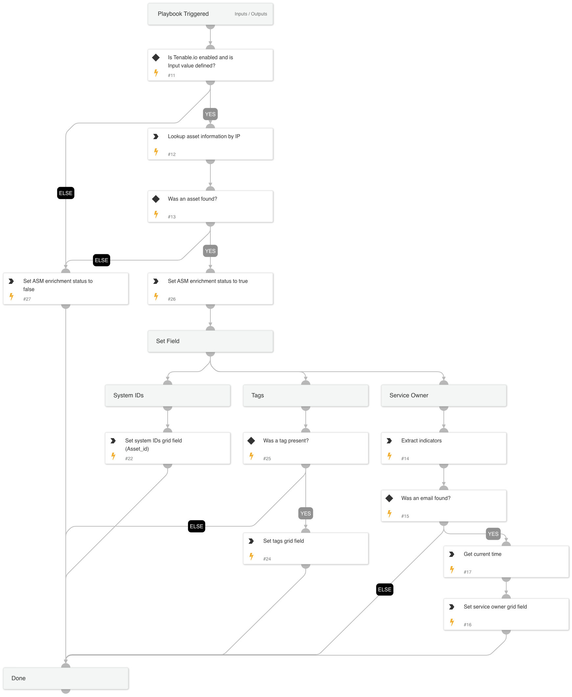

Given the IP address this playbook enriches Tenable.io information relevant to ASM alerts.

## Dependencies
This playbook uses the following sub-playbooks, integrations, and scripts.

### Sub-playbooks
This playbook does not use any sub-playbooks.

### Integrations
This playbook does not use any integrations.

### Scripts
* GetTime
* GridFieldSetup

### Commands
* extractIndicators
* tenable-io-get-asset-details

## Playbook Inputs
---

| **Name** | **Description** | **Default Value** | **Required** |
| --- | --- | --- | --- |
| Indicator Query | Indicators matching the indicator query will be used as playbook input |  | Optional |
| IPAddress | IP addresses to enrich. | alert.remoteip | Required |

## Playbook Outputs
---

| **Path** | **Description** | **Type** |
| --- | --- | --- |
| AWS.EC2.Instances | AWS EC2 information. | unknown |
| AWS.EC2.SecurityGroups | AWS Security group information. | unknown |
| AWS.IAM.Users | AWS IAM information. | unknown |

## Playbook Image
---
